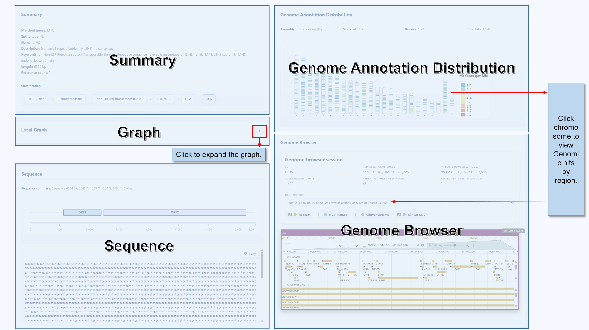
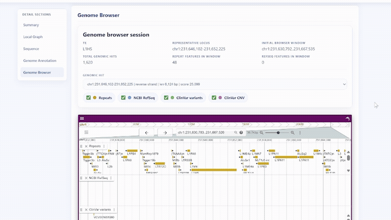
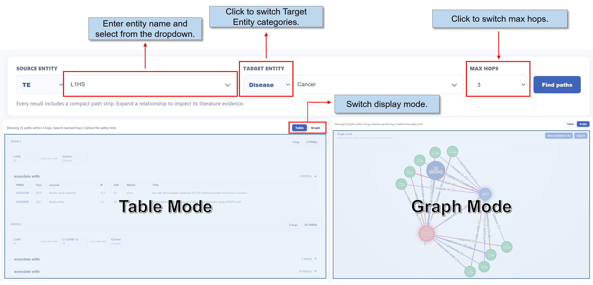
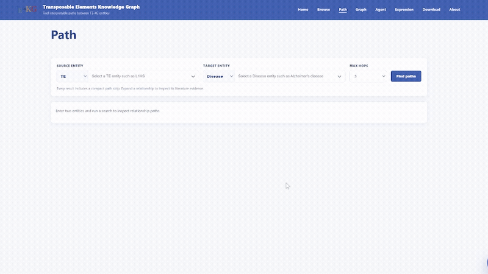
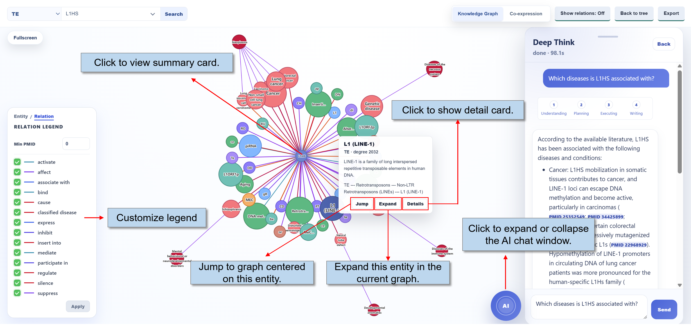

# TE-KG About Guide

This document is the English source for the public About page. It contains both user-facing text and the static or animated media used by the website.

## 1. About TE-KG

TE-KG is an integrated resource for human transposable elements. It connects classification systems, literature-derived relationships, representative sequence and genomic records, expression and co-expression contexts, downloadable data, and evidence-grounded natural-language question answering.

### What TE-KG is

TE-KG brings several complementary views of human transposable elements into one interface rather than treating every dataset as an isolated table. The resource includes a TE catalog, entity details, literature-derived relationship graphs, classification views, expression and co-expression exploration, and downloadable data. Its central aim is to make TE information easier to explore while keeping source evidence and interpretation boundaries visible.

### TE-KG architecture

TE-KG integrates three main data streams. Literature is screened before AI-assisted entity and relationship extraction, normalization, and manual curation. RMSK genomic annotations and RepBase classification and sequence records are harmonized into a shared taxonomy and sequence layer. Expression datasets are processed separately and used to build context-specific TE-gene co-expression results. These curated resources are exposed through integrated APIs and evidence services that support Browse, Path, Graph, Expression, Agent, and DeepThink workflows.

### Data access routes

- Use Home to review the current overall composition of the database.
- Use Browse to find a TE and inspect its summary, local graph, sequence, genome annotation, and genome browser views.
- Use Graph to explore knowledge relationships, TE classification, and co-expression networks; use Path to inspect connections between two specified entities.
- Use Expression to examine abundance patterns in the currently available expression datasets.
- Use Agent or DeepThink to ask evidence-grounded natural-language questions and continue with follow-up questions in the current conversation.
- Use Download to obtain files currently provided by the website.
- Use the AI window to access DeepThink from supported pages across the site.

## 2. Home Overview

Home is the main overview entry point for TE-KG. It introduces the resource, summarizes the current database composition, and provides shortcuts to the principal public workflows.

- Overview summarizes the purpose and scope of TE-KG.
- Dataset Status reports the current Neo4j database scale. Its donut charts show entity composition, TE classification, and relation predicate composition.
  - Entity Composition counts the principal knowledge-graph entity categories among stored nodes.
  - TE Classification can switch classification levels, allowing the chart to move from broad classes to more specific levels.
  - Relation Composition uses detailed predicate counts to reveal common relationship types.
- Quick Links provide direct access to the main lookup, graph, expression, download, and help workflows.

## 3. Browse

Browse provides the complete workflow for finding and reviewing a TE record. Its content includes Summary, Local Graph, Sequence, Genome Annotation Distribution, and Genome Browser.

- Summary confirms the current record and displays the available metadata.
- Local Graph shows nearby entities and relationships.
- Sequence displays a supported representative or consensus sequence and its available annotation; it does not represent every genomic copy of a TE.
- Genome Annotation Distribution summarizes supported hits on the current assembly.
- Genome Browser shows specific genomic locations. Selecting a hit in Genome Annotation Distribution updates the Genomic hit list.

## 4. Path

Path searches stored connections between two specified entities and presents evidence for each relationship in a verifiable form. It is intended for questions about how two entities are connected rather than for looking up one entity in isolation.

### Search structure

- Both sides of the search form contain a narrow category selector and a wider entity selector.
- After an entity is selected on one side, candidates offered on the other side are constrained to entities connected with the selected entity.
- Increase MAX HOPS to search a wider multi-hop neighborhood.

### Reading path results

Results are available in two modes: Table and Graph.

- Table records each path in detail, including entity names, entity categories, and relationships between entities. Select a relationship to expand or collapse its supporting literature table. Evidence rows can include PMID, Year, Journal, IF, JCR, Match, and Title.
- Graph combines all returned paths in one network. Select nodes or edges to inspect details, including literature associated with an edge. Use Show relations to display relationship labels and Export to export the graph view.

## 5. Graph Workspace

Graph provides three complementary visual workflows: literature-derived knowledge relationships, TE classification in Tree or Graph form, and an independent context-specific co-expression network.

### Classification Tree and Graph

- When TE classification is displayed, Tree provides a stable hierarchical view, while Graph provides a force-directed view that can be rearranged interactively.
- All includes TE names not covered by RMSK and RepBase as well as some non-standard names.

### Graph operations

- Select an entity category and enter an entity name in the search box to move directly to its graph.
- Use Show relations to display edge labels, Back to entity to return to the previous graph, and Export to export the current graph.
- When the searched entity is a TE, use Knowledge Graph and Co-expression to switch between its two network views.
- Select legend entries to emphasize content temporarily, or change legend filters and select Apply to focus on specific entity or relationship types.

### Knowledge Graph workspace

- Select a node to open an information card showing its category, connection count, and summary. Jump opens a graph centered on that node, Expand adds its neighborhood to the current graph, and Detail opens available detailed or TE classification information.
- Searched and expanded nodes are marked with a ripple cue.
- Use Show relations to display edge labels and Export to export graph information.
- Entity legends distinguish TE, disease, and other node types. Relationship legends show predicate categories such as activate and affect and support category filtering.

### Co-expression workspace

- Use the legend to show or hide TE and Gene nodes, identify module hubs, and choose the currently visible edge range.
- When Expression activity is enabled, nodes display ripples that reflect expression intensity.
- Choose a context from the Context menu.
- The displayed co-expression network uses the thresholds Spearman r >= 0.4 and FDR <= 0.05.

## 6. Agent and DeepThink

Agent is the natural-language research interface. Agent mode collects evidence through a structured multi-stage workflow, while DeepThink uses a shorter evidence-grounded reasoning flow for more direct questions.

### Choosing a mode

- Agent integrates sequence, genomic location, expression, disease relationships, literature, and other database areas. It uses multiple models and proceeds through six stages: Understanding, Planning, Collecting, Executing, Integrating, and Writing.
- DeepThink is suitable when a direct question can be handled with a shorter reasoning and writing process. It uses one model and proceeds through four stages: Understanding, Planning, Executing, and Writing.

### Asking questions

- Use clear TE, disease, or gene names, or a PMID, whenever possible. Ask for clarification when an abbreviation or entity name is ambiguous.
- Questions may cover TE classification, sequences, genomic records, expression, co-expression, graph relationships, diseases, genes, or literature evidence.
- When literature evidence matters, follow PMID links in the answer to inspect the corresponding PubMed records.
- Answers may remain appropriately limited when the database lacks the requested evidence. Absence from a retrieved result does not demonstrate biological absence.

## 7. Expression

Expression is the TE abundance lookup interface. It supports catalog-level filtering and TE detail views across normal tissue, normal cell line, and cancer cell line datasets.

### Finding a TE

- Use Keyword to search for a TE, or combine dataset source, top-context text, and minimum global median filters to narrow the table. Use Sort to order records by the available summary measure, then select a TE row to open its detail view.
- When the corresponding data are available, the browse table summarizes the top normal tissue, normal cell line, and cancer cell line contexts together with the coefficient of variation.
- On the detail page, use Display Controls to choose the Chart Type, Metric, and Order.
