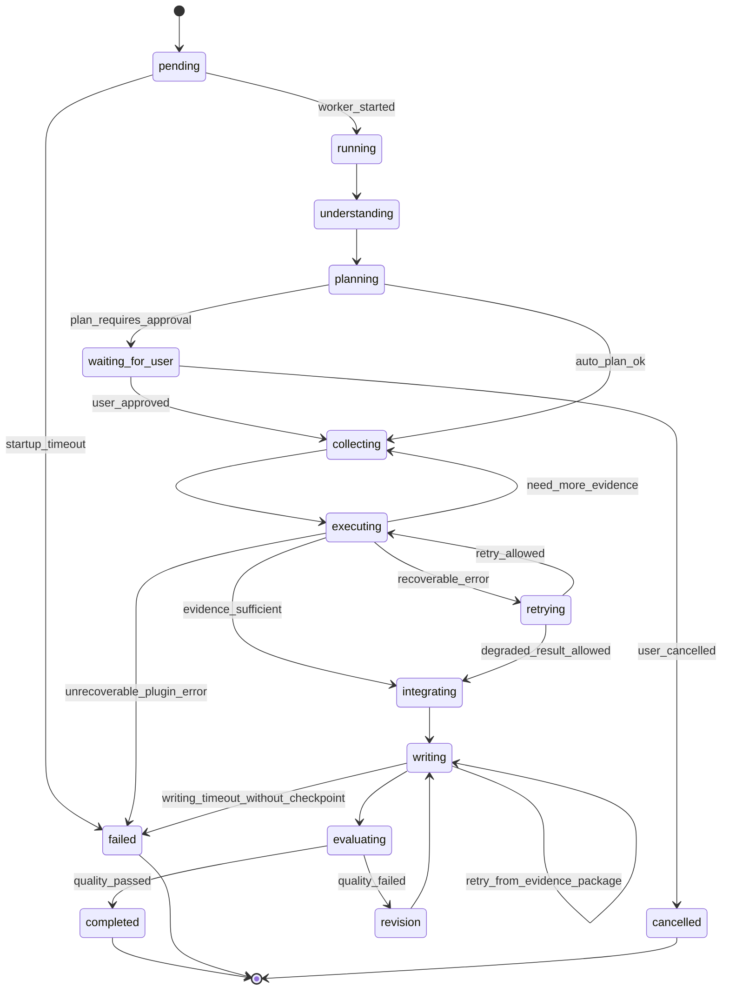

# TE-KG Agent 开发指南：让 Agent 真正区别于 Deep Think

> 本文档基于 2026-05-18 的一次结构化阅读整理。阅读方式不是逐字翻译论文，而是按五轮主题读取本地引入资料的摘要、方法、实验、结论、局限，并补充 KG-Agent 相关高质量论文。目标是把理论变成 TE-KG 可执行的产品与工程路线。
>
> 2026-05-27 更新：本文仍保留“未来蓝图”的理论框架，但第 9 节已补充截至 Phase 5C 的实际落地状态。当前事实以 `docs/RELIABILITY.md`、`docs/exec-plans/completed/` 和 `docs/eval/runs/` 中的验证记录为准；本文用于解释方向、边界和下一步研发判断。

## 0. 一句话结论

Deep Think 应该成为 TE-KG 的即时问答层：快速、轻量、站内导航友好、单轮可完成。

Agent 不应该继续与 Deep Think 竞争普通问答。Agent 应该成为 TE-KG 的异步研究工作流：可计划、可恢复、可审计、可导出，能够把知识图谱拓扑、站内结构化数据、文献证据和用户目标组织成研究级产物。

截至 Phase 5C 的实际结论更具体：

- Deep Think 已经有 live evidence 支持其作为全站默认即时问答模式。Phase 5B 中 DT 30/30 成功，且在简单查询、页面导航、局部事实问题上更快、更稳。
- Agent 已经完成 evidence package、evidence walk、report plan、integrity gate、compact preflight、DT/Agent live eval 和 deterministic semantic proxy 的第一版，但它仍不是普通问答默认入口。
- Agent 的当前价值是研究任务候选：机制综述、证据审计、图谱排名、批量比较、报告生成。Phase 5C semantic proxy 在 Phase 5B saved run 上给出 Agent wins 13/30、Deep Think wins 11/30、tie 6/30，说明 Agent 有研究型任务潜力，但仍不能声称已完成 claim-level biomedical truth verification。

本文提出一个适合论文表达的核心方向：

**Graph-grounded Research Agent for TE-KG**：以知识图谱为任务骨架，以插件为可审计行动，以 evidence package 为中间产物，以可恢复工作流和评估体系为工程保证，最终输出可复查的 TE 研究报告、证据表、排名结果和机制假说。

## 1. 阅读路线与读后札记

### 1.1 第一轮：Agent 范式

阅读资料：

- ReAct: Synergizing Reasoning and Acting in Language Models
- Plan-and-Solve Prompting
- Reflexion
- Toolformer
- Anthropic Building Effective Agents
- LangGraph 文档索引
- OpenAI deep research system card 索引

我的理解：

- ReAct 的价值不在于暴露一堆“思考过程”，而在于把内部推理和外部行动拆开，让人能检查“为什么调用工具、工具返回了什么、下一步如何受影响”。
- Plan-and-Solve 说明复杂任务不能直接进入插件执行。Agent 必须先形成可检查计划，尤其是在多实体、多证据、多页面、多文献任务中。
- Reflexion 的重点不是让模型自言自语，而是把失败变成下一次执行可用的经验：哪个实体没解析、哪个插件超时、哪个证据不足、Writing 为什么失败。
- Toolformer 说明工具调用要有“何时不用工具”的判断。TE-KG 现在已经有 Deep Think 覆盖大量短问答，Agent 更不能无差别拉长插件链。
- Anthropic 的工程视角更接近产品落地：prompt chaining、routing、parallelization、orchestrator-workers、evaluator-optimizer 都可以映射到 TE-KG 的 Agent 六阶段。

迁移到 TE-KG：

- Agent 的六阶段不应只是 UI 动画。它们应该对应可持久化状态、可恢复 checkpoint、可审计事件。
- Agent 不应把所有中间工具结果一次性塞给 Writing。它需要先把证据整理成结构化 evidence package，再让 Writing 写报告。
- Agent 的“反思”不应默认调用 LLM 生成旁白，而应变成失败归因和重试策略。

### 1.2 第二轮：RAG、KG-QA 与 Text2Cypher

阅读资料：

- Retrieval-Augmented Generation for Knowledge-Intensive NLP Tasks
- From Local to Global: A Graph RAG Approach
- Auto-Cypher
- Neo4j Text2Cypher 资料索引
- Microsoft GraphRAG 资料索引

我的理解：

- RAG 的本质是把参数记忆和非参数记忆分开。对 TE-KG 来说，非参数记忆不只是文本，还有 Neo4j 图谱、CSV/统计数据、序列、表达矩阵、站内页面锚点。
- GraphRAG 的重要启发是 local/global 两类问题要分开。用户问“L1HS 与哪些疾病有关”是局部检索；问“知识图谱里哪个疾病与 TE 关联度最大”或“LINE-1 如何参与癌症机制”就带有全局 sensemaking。
- Text2Cypher 的关键不是让 LLM 直接写 Cypher，而是 schema grounding、query taxonomy、执行验证和错误回退。生成 Cypher 没有执行验证，会把幻觉伪装成图谱分析。
- Auto-Cypher 的启发是可以构造 TE-KG 自己的 Text2Cypher benchmark：自然语言问题、schema 片段、期望 Cypher、执行结果、难度标签。

迁移到 TE-KG：

- GraphPlugin 应承担稳定的已知关系检索。
- GraphAnalyticsPlugin 应承担拓扑排名、中心性、最短路径、社区、疾病-TE 关联强度等图分析任务。
- CypherExplorerPlugin 应只在用户问题无法由固定插件覆盖，且有明确 schema 约束时使用。
- Agent 的研究能力应围绕“图谱证据路径 + 文献证据 + 结构化数据”融合，而不是只让 LLM 总结插件文本。

### 1.3 第三轮：工作流工程

阅读资料：

- Temporal durable workflow 思路
- AWS idempotency best practices 索引
- Azure Durable Functions fan-out/fan-in 索引
- Harel Statecharts 索引
- MDN Server-Sent Events 索引

我的理解：

- 长任务 Agent 最怕的是“看起来在运行，实际上某一步已不可恢复”。因此 Agent run 应该是 durable state machine，而不是长请求或松散脚本。
- workflow 和 activity 的边界非常适合 TE-KG：workflow 管计划、状态、重试、checkpoint；activity 管具体插件、LLM 调用、文件写入。
- 幂等不是锦上添花。只要有 worker、watchdog、重试，就必须保证插件重复执行不会污染状态。
- SSE/轮询只是事件展示层，不应决定业务状态。业务状态必须由服务端 run state 持久化。

迁移到 TE-KG：

- `Understanding -> Planning -> Collecting -> Executing -> Integrating -> Writing` 应有明确状态转移表。
- 每次插件调用都应有 `run_id`、`step_id`、`plugin_call_id`、`input_hash`、`status`、`duration_ms`、`error_type`。
- Writing 失败不应导致整轮研究证据丢失。应支持从 Integrating 之后重新写作。
- 批量 TE/疾病分析应采用 fan-out/fan-in：每个实体对单独执行，最终聚合成表和报告。

### 1.4 第四轮：插件契约与可观测性

阅读资料：

- Model Context Protocol specification
- MCP tool result schema
- JSON Schema
- OpenAPI
- OpenTelemetry

我的理解：

- 插件不是 PHP 函数列表，而是 Agent 的行动空间。行动空间如果没有契约，Agent 就无法稳定计划、评估和恢复。
- MCP 的启发是工具需要清楚描述 input schema、output schema、metadata 和错误。TE-KG 不一定要直接引入 MCP，但应该吸收契约思想。
- JSON Schema 可以让插件输入输出从“约定俗成数组”变成可验证结构。
- OpenTelemetry 的核心价值是把一次用户问题、一次 Agent run、一次插件调用、一次 LLM 调用串成 trace。现在很多问题靠猜，未来应该靠 trace 定位。

迁移到 TE-KG：

- 每个插件统一返回 envelope：

```json
{
  "plugin": "Graph Plugin",
  "status": "ok|partial|empty|failed",
  "intent": "relationship|mechanism|navigation|sequence|expression|genome|analytics",
  "input": {},
  "summary": "",
  "evidence_items": [],
  "citations": [],
  "routes": [],
  "metrics": {
    "duration_ms": 0,
    "result_count": 0,
    "confidence": 0.0
  },
  "errors": []
}
```

- 插件错误统一分层：`empty_result`、`invalid_entity`、`invalid_query`、`infra_unavailable`、`timeout`、`llm_failure`、`schema_violation`。
- Agent 不直接消费插件原始输出，而消费统一 envelope 与 evidence package。

### 1.5 第五轮：评估体系

阅读资料：

- RAGAS
- AgentBench
- GAIA
- Berkeley Function Calling Leaderboard 索引

我的理解：

- RAGAS 的价值是把“答案看起来不错”拆成 faithfulness、answer relevance、context precision、context recall。TE-KG 的回答也应如此拆分。
- AgentBench 的失败类型很适合 TE-KG：context limit exceeded、invalid format、invalid action、task limit exceeded。当前 TE-KG 的 Writing timeout 和插件链过重，实际就属于任务边界和上下文管理问题。
- GAIA 的启发是测试题要真实、需要多步工具、答案唯一、自动可评估。TE-KG 需要自己的 GAIA-style golden set，而不是只靠人工问几句“L1HS在哪”。
- BFCL 的思想可用于评估插件选择和参数正确性：是否选对插件、是否解析对实体、是否构造对 URL 或 Cypher。

迁移到 TE-KG：

- 评估不应只看最终答案，应覆盖插件调用准确率、实体链接准确率、证据 grounding、引用 correctness、Writing 失败归因和延迟。
- 需要将“DT 能做的短任务”和“Agent 才应该做的长任务”分开建 benchmark，否则会把 Agent 训练成慢版 DT。

### 1.6 额外补读：KG-Agent 与 KG/Text 紧耦合

补充资料：

- Think-on-Graph 2.0
- KGARevion

我的理解：

- Think-on-Graph 2.0 的关键是 KG 和文本不是松散拼接，而是互相驱动：KG 引导文本检索，文本上下文反过来修剪下一轮图探索。
- KGARevion 的关键是 LLM 先生成候选 triplets，再用 KG 审核、修订、最后回答。它把 KG 作为 verifier，而不是只作为 retriever。
- 这两点非常适合 TE-KG。TE-KG 有结构化图谱、站内页面、统计数据和文献，这意味着 Agent 可以做“KG-guided evidence walk”，而不是普通 RAG。

迁移到 TE-KG 的论文亮点：

- **TE-KG Evidence Walk**：从用户问题抽取 TE、疾病、组织、基因组位置等 topic entities，在 KG 上探索候选关系路径，再用站内数据和文献验证路径。
- **Graph-as-Verifier**：LLM 或文献提出的机制性 claim 必须被映射到图谱关系、文献引用或站内数据证据；无法映射的 claim 标成 hypothesis，而不是 factual conclusion。
- **Dual-source Sufficiency Gate**：sufficiency 不只问 LLM“够不够”，而是同时检查图谱覆盖率、文献覆盖率、实体消歧置信度和引用质量。

## 2. Deep Think 与 Agent 的产品边界

### 2.1 Deep Think 应该做什么

Deep Think 是默认问答入口，适合：

- 单实体事实查询：序列、位置、表达、分类、页面入口、下载入口。
- 局部关系查询：某个 TE 相关疾病、某个疾病相关 TE、某个节点附近关系。
- 站内导航：某个属性应该去哪个页面或面板看。
- 简短解释：无需多轮证据审计的概念解释。
- 页面侧边问答：无需创建长任务，不打断用户浏览。

Deep Think 的设计原则：

- 快，宁可给候选入口，也不要创建复杂任务。
- 尽量 deterministic，避免为简单问题调大模型长链路。
- 输出可以驱动当前页面，例如 preview 图谱高亮，但不持久化研究状态。

### 2.2 Agent 应该做什么

Agent 是研究任务入口，适合：

- 机制研究：如 “LINE-1 如何导致癌症？”
- 证据比较：如 “哪些论文支持 LINE-1 与 Alzheimer 的关系？证据强度如何？”
- 图分析：如 “知识图谱里与 TE 关联度最高的疾病是什么？为什么？”
- 批量分析：如 “比较 20 个 TE family 与癌症、神经疾病、免疫疾病的关系。”
- 报告生成：如 “为 L1HS 写一份包含序列、位置、表达、疾病、文献证据的研究报告。”
- 审计任务：如 “列出这个结论依赖哪些图谱边、哪些文献句子、哪些站内数据。”

Agent 的设计原则：

- 不追求秒回，而追求可恢复、可审计、可导出。
- 每一步都产生可检查 artifact。
- 最终答案不是聊天回复，而是研究产物。

### 2.3 一条硬规则

如果一个问题可以在 1-2 个插件内完成，并且不需要证据比较、批量任务或报告导出，默认交给 Deep Think。

如果一个问题需要 3 个以上证据源、多个实体、长文献阅读、图拓扑分析、失败恢复或可导出结果，才进入 Agent。

当前实现补充：

- Agent 在 simple Deep Think-suitable task 上已有 compact preflight gate。即使用户强行走 Agent，简单查询也会尽量跳过完整 Evidence Walk Writing，返回兼容 Agent API 的轻量边界响应。
- Live eval scorer 已避免把这种 compact Agent 因“调用了多个轻量插件”误判为 overkill；现在 overkill 还要求 artifact score 足够高。
- 这条规则仍是产品边界，不是最终语义分类器。`task_complexity` 与 research-signal 仍含启发式成分，未来需要更多样本和语义评估校准。

## 3. 推荐 Agent 总体架构

### 3.1 分层架构

```text
User Task
  -> Task Classifier
  -> Plan Builder
  -> Human-visible Plan
  -> Durable Workflow
  -> Plugin Activities
  -> Evidence Package Builder
  -> Sufficiency and Verification Gates
  -> Report Writer
  -> Evaluator
  -> Exportable Artifacts
```

### 3.2 六阶段重新定义

当前六阶段可以保留，但每阶段要有工程含义。

| Stage | 当前风险 | 推荐定义 | 产物 |
| --- | --- | --- | --- |
| Understanding | 只做 UI 状态 | 解析任务类型、实体、输出要求、可用数据源 | `task_profile.json` |
| Planning | 计划可能太虚 | 生成插件链、证据需求、停止条件、失败策略 | `execution_plan.json` |
| Collecting | 容易变成插件堆叠 | 按证据需求选择插件，不盲目扩链 | `plugin_queue.json` |
| Executing | 工具输出不统一 | 每个插件作为 activity，统一 envelope | `plugin_call_*.json` |
| Integrating | 容易塞大 payload | 抽取 claims、evidence、citations、graph paths | `evidence_package.json` |
| Writing | 超时和幻觉高发 | 从 evidence package 写报告，并做引用约束 | `report.md` |

### 3.3 Agent run 的状态机



## 4. TE-KG Agent 的创新点设计

### 4.1 创新点一：TE-KG Evidence Walk

核心思想：

把用户问题转化为 KG 上的有约束探索。Agent 不只是检索边，而是沿着 TE、disease、gene、tissue、genomic region、publication 等节点进行 evidence walk。

执行方式：

1. 抽取 topic entities，例如 `L1HS`、`LINE-1`、`cancer`、`Alzheimer's disease`。
2. 在 KG 中获取一跳关系，识别关系类型和节点类型。
3. 对机制类问题扩展到多跳路径，例如 `TE -> gene regulation -> pathway -> disease`。
4. 用站内结构化数据验证路径节点是否存在，例如序列、表达、基因组位置。
5. 用 LiteraturePlugin 和 LiteratureReadingPlugin 查找文献支持。
6. 生成 path-level evidence：每条结论对应图路径、文献、站内数据、置信度。

适合论文表达的贡献：

- 将 TE 研究问题转化为 graph-guided evidence walk。
- 用 KG 拓扑限制检索范围，减少 RAG 盲检索。
- 用 path-level evidence 支持可解释机制推断。

### 4.2 创新点二：Graph-as-Verifier

核心思想：

KG 不只回答问题，也审核答案。LLM 或文献抽取出的 claim 必须接受图谱验证、站内数据验证或 citation 验证。

Claim 示例：

```json
{
  "claim": "LINE-1 activity is associated with cancer through genome instability and gene regulation.",
  "entities": ["LINE-1", "cancer"],
  "claim_type": "mechanism",
  "required_support": ["graph_path", "literature_evidence"],
  "verification_status": "supported|partially_supported|unsupported|hypothesis"
}
```

验证规则：

- 图谱有直接边和文献支持：`supported`
- 图谱有路径但文献不足：`partially_supported`
- 文献有说法但图谱无对应关系：`literature_supported_graph_missing`
- LLM 推断但无证据：`hypothesis`
- 与图谱或数据冲突：`conflicting`

论文价值：

- 把 KG 从 retrieval source 提升为 verification layer。
- 可以量化 claim faithfulness，而不是只评价整段答案。

### 4.3 创新点三：Dual-source Sufficiency Gate

当前 sufficiency 如果只靠 LLM 判断，会出现超时或过早停止。建议改成规则 + LLM 双层门。

规则层指标：

- `entity_confidence`: 实体解析置信度。
- `graph_coverage`: 是否找到足够图谱边或路径。
- `literature_coverage`: 是否有足够文献或摘要。
- `citation_coverage`: 关键 claim 是否有 citation。
- `data_coverage`: 序列、位置、表达、下载等站内数据是否查到。
- `uncertainty_count`: 未支持 claim 数量。

LLM 层只负责判断：

- 现有证据是否足够回答用户原问题。
- 哪些部分只能作为 hypothesis。
- 是否需要继续查某类证据。

推荐输出：

```json
{
  "is_sufficient": false,
  "missing_evidence": ["literature_fulltext", "graph_path"],
  "next_plugins": ["Literature Reading Plugin", "Graph Analytics Plugin"],
  "stop_reason": null
}
```

### 4.4 创新点四：TE-specific Research Artifacts

Agent 的最终产物不应只有段落答案，而应生成适合 TE 研究的 artifact。

推荐 artifact：

- `TE dossier`: 某个 TE 的序列、分类、表达、位置、疾病、文献摘要。
- `Disease association matrix`: TE x disease 关系矩阵，含边数、文献数、置信度。
- `Mechanism map`: 机制路径图，含 graph path 与文献句子。
- `Evidence audit table`: claim、supporting edge、supporting citation、confidence、limitations。
- `Cypher appendix`: 用过的 Cypher、结果摘要、执行状态。
- `Reproducibility bundle`: run config、插件版本、输入、输出 hash。

### 4.5 创新点五：Agent as a Research Compiler

可以把 Agent 定义为研究编译器：

- 用户自然语言是 source program。
- Planning 是编译期分析。
- Plugins 是可执行指令。
- Evidence package 是 intermediate representation。
- Writing 是 code generation/report generation。
- Evaluator 是 type checker/verifier。

这套比喻适合论文，因为它强调可验证中间表示，而不是把 Agent 描述成黑盒聊天机器人。

## 5. 插件系统设计指南

### 5.1 插件分级

| 级别 | 插件类型 | 示例 | 是否适合 DT | 是否适合 Agent |
| --- | --- | --- | --- | --- |
| L0 | deterministic lookup | SiteNavigator, Sequence, Genome | 是 | 是，但不应扩大链路 |
| L1 | local evidence | Graph, Expression, Tree | 是 | 是 |
| L2 | graph analytics | GraphAnalytics, CypherExplorer | 少量 | 是 |
| L3 | external evidence | Literature, LiteratureReading | 视问题 | 是 |
| L4 | meta/evaluator | CitationResolver, EvidenceVerifier | 少量 | 是 |

### 5.2 插件统一契约

每个插件至少声明：

- `name`
- `version`
- `capabilities`
- `input_schema`
- `output_schema`
- `estimated_cost`
- `timeout_policy`
- `idempotency_key_fields`
- `failure_modes`

### 5.3 插件输出 envelope

```json
{
  "plugin": "Site Navigator Plugin",
  "version": "1.0.0",
  "status": "ok",
  "intent": "navigation",
  "matched_entity": "L1HS",
  "matched_capability": "genome_annotation_distribution",
  "answer_markdown": "[Genome Annotation Distribution](http://localhost/TE-/search.php?q=L1HS&type=TE#search-karyotype-panel)",
  "candidate_routes": [],
  "evidence_items": [],
  "citations": [],
  "metrics": {
    "duration_ms": 12,
    "confidence": 0.95,
    "result_count": 1
  },
  "errors": []
}
```

### 5.4 插件路由策略

Deep Think 路由：

- 先判断是否站内导航。
- 再判断是否 deterministic lookup。
- 再判断是否局部图谱关系。
- 最后才进入轻量文献或机制路径。

Agent 路由：

- 先生成任务计划。
- 按 evidence requirement 选择插件。
- 每执行一个插件后重新评估 sufficiency。
- 不因单个插件失败立即失败，除非该插件是任务必要前提。

### 5.5 插件不要做的事

- 不要在插件里写最终长答案。
- 不要返回不可解析的大段自然语言作为唯一输出。
- 不要吞掉错误，只返回空数组。
- 不要把 LLM 推断伪装成数据库事实。
- 不要让插件之间隐式依赖全局变量。

## 6. Evidence Package 设计

### 6.1 为什么需要 evidence package

当前 Agent 的 Writing 容易成为瓶颈，本质原因通常不是模型单点问题，而是最终写作输入过大、结构不清、证据未压缩。

Evidence package 是 Agent 的中间表示。它应该比原始插件输出更小，但比最终答案更可审计。

### 6.2 推荐结构

```json
{
  "question": "LINE-1是如何导致癌症的？",
  "task_type": "mechanism_review",
  "entities": [
    {"name": "LINE-1", "type": "TE", "confidence": 0.98},
    {"name": "cancer", "type": "Disease", "confidence": 0.92}
  ],
  "claims": [
    {
      "id": "claim_001",
      "text": "LINE-1 may contribute to cancer through insertional mutagenesis and genome instability.",
      "claim_type": "mechanism",
      "support_level": "supported",
      "graph_paths": ["path_001"],
      "citations": ["pmid_001"],
      "site_data": [],
      "limitations": []
    }
  ],
  "graph_paths": [
    {
      "id": "path_001",
      "nodes": ["LINE-1", "genome instability", "cancer"],
      "edges": ["associated_with", "contributes_to"],
      "source_plugin": "Graph Plugin"
    }
  ],
  "citations": [
    {
      "id": "pmid_001",
      "title": "",
      "url": "",
      "supporting_sentence": "",
      "source_plugin": "Literature Reading Plugin"
    }
  ],
  "negative_or_missing_evidence": [],
  "quality": {
    "graph_coverage": 0.75,
    "literature_coverage": 0.80,
    "citation_coverage": 0.70,
    "overall_confidence": 0.76
  }
}
```

### 6.3 Writing 输入规则

Writing 只能接收：

- 用户问题。
- 输出格式要求。
- evidence package。
- 关键引用和必要站内链接。

Writing 不应接收：

- 所有插件原始 payload。
- 所有候选文献全文。
- 全量图谱邻域。
- 未压缩的日志事件。

## 7. 工作流与可靠性设计

### 7.1 持久化 checkpoint

每个 Agent run 应保存：

- `payload.json`: 用户输入和页面上下文。
- `task_profile.json`: intent、entities、task type。
- `execution_plan.json`: 插件链、证据需求、停止条件。
- `plugin_calls/*.json`: 每次插件输入输出 envelope。
- `evidence_package.json`: 压缩后的证据包。
- `report.md`: 最终报告。
- `evaluation.json`: 自动评估结果。

### 7.2 重试策略

| 失败类型 | 是否重试 | 策略 |
| --- | --- | --- |
| `empty_result` | 否或换插件 | 尝试实体 alias 或候选页面 |
| `invalid_entity` | 否 | 回到 Understanding |
| `infra_unavailable` | 是 | 短重试，失败后降级 |
| `timeout` | 是 | 缩小输入或换 summarization |
| `llm_failure` | 是 | 使用 deterministic fallback |
| `schema_violation` | 是 | 修复格式，最多一次 |
| `writing_timeout` | 是 | 从 evidence package 重新写 |

### 7.3 幂等设计

插件调用的 idempotency key：

```text
run_id + plugin_name + plugin_version + normalized_input_hash
```

如果 worker 重启，同一个 key 的已完成结果直接复用，不重复调用外部服务。

### 7.4 Watchdog

Agent run 必须有 watchdog：

- `pending` 超时：标记 startup failed。
- `running` 超时：标记 failed，但保留已完成 artifacts。
- `writing` 超时：保留 evidence package，允许只重试 Writing。
- `plugin` 超时：记录插件失败类型，并判断是否可降级。

## 8. 评估体系

### 8.1 Golden set 分层

DT golden set：

- 单实体序列查询。
- 单实体位置查询。
- 单实体表达查询。
- 站内页面入口查询。
- 局部关系查询。

Agent golden set：

- 多跳机制问题。
- 文献证据比较。
- 图谱排名/中心性问题。
- 批量 TE/疾病关系矩阵。
- 报告生成。
- 失败恢复和引用审计。

### 8.2 指标

| 指标 | 问题 |
| --- | --- |
| Intent accuracy | 是否识别对任务类型 |
| Entity linking accuracy | TE/disease/tissue 是否解析正确 |
| Tool-call accuracy | 是否调用正确插件 |
| Tool argument accuracy | 插件参数是否正确 |
| Graph path correctness | 图谱路径是否真实存在 |
| Cypher execution accuracy | 生成 Cypher 是否可执行且结果正确 |
| Faithfulness | 结论是否由证据支持 |
| Citation correctness | 引用是否支持对应 claim |
| Context precision | 检索内容是否聚焦 |
| Context recall | 是否漏掉关键证据 |
| Latency by stage | 哪个阶段耗时 |
| Failure attribution | 失败原因是否可定位 |
| User artifact success | 是否产出用户需要的表/报告/链接 |

当前已落地的评估分层：

- Phase 5A：deterministic comparison contract，比较 DT 与 Agent 的完成状态、artifact depth、overkill、latency、value-added proxy。
- Phase 5B：通过网页同款后端路径完成 live eval：DT 使用 `api/deep_think_stream.php`，Agent 使用 `api/agent_runs.php` + `api/agent_run_status.php`。
- Phase 5B.1：修复边界 canary，`P5A_B_005`、`P5A_B_029`、`P5A_B_001` 最新 live 记录均为 `dt_ok=true`、`agent_ok=true`、`agent_overkill=false`、errors 为空。
- Phase 5C：新增 deterministic semantic proxy，输出 `claim_support_score`、`citation_relevance_score`、`missing_evidence_score`、`research_usefulness_score` 和 `semantic_winner`。它是 triage，不是事实核验器。

### 8.3 TE-KG GAIA-style 测试题

好的 Agent 测试题应满足：

- 真实用户可能会问。
- 需要多个步骤或多个插件。
- 最终答案可验证。
- 允许记录中间轨迹。
- 不依赖模糊主观评分。

示例：

1. “在 TE-KG 中找出与疾病关联边最多的疾病，并列出前 5 个支持关系最多的 TE。”
2. “比较 L1HS、AluY、HERVK 在 normal tissue 表达和 cancer cell line 表达中的差异，并输出表格。”
3. “为 LINE-1 与癌症关系生成 evidence audit table，要求每条机制 claim 至少有图谱路径或文献支持。”
4. “找出 L1HS 的 Genome Annotation Distribution 页面入口、序列入口和 Genome Browser 入口，并解释它们分别看什么。”
5. “如果 Literature Plugin 返回空结果，Agent 是否能降级为图谱证据报告并明确说明缺失文献？”

## 9. 近期工程路线

### 9.1 第一阶段：巩固边界

状态：第一版已于 2026-05-25 落地，具体收尾见 `docs/exec-plans/completed/agent-deepthink-boundary-plugin-envelope.md`。

目标：

- DT 保持全站默认即时问答。
- Agent 只处理研究任务。

任务：

- 给问题路由增加 `task_complexity`。
- 简单问题自动建议使用 DT。
- Agent 页面增加研究任务模板：机制综述、证据审计、批量比较、图谱排名、报告生成。

### 9.2 第二阶段：统一插件契约

状态：第一版已于 2026-05-25 落地，当前通过 `PluginResultEnvelope` 在消费边界兼容 legacy payload；旧消费者迁移留到 evidence package 阶段逐步完成。

目标：

- 所有插件输出统一 envelope。
- Agent 不再解析各插件的任意数组结构。

任务：

- 定义 `PluginResultEnvelope`。
- 为每个插件补 `status`、`metrics`、`evidence_items`、`errors`。
- 用 JSON Schema 做测试。

### 9.3 第三阶段：Evidence Package

状态：Agent Evidence Package v1 已于 2026-05-26 落地。Agent Integrating 阶段生成并校验 `evidence_package`，Agent Writing 改为只读 `evidence_package`，不再使用旧的散装 `supported_claims`、`citations` 或 raw plugin payload 作为写作证据主体。Deep Think 暂未切换到该路径。

目标：

- 解决 Writing payload 过重。
- 提高引用和 claim 可审计性。

任务：

- 在 Integrating 阶段生成 `evidence_package.json`。
- Writing 只读 evidence package。
- 增加 claim-level citation mapping。

第一版实际产物：

- `api/agent/contracts/EvidencePackage.php` 定义 `evidence_package.v1` 构建与校验。
- `api/agent/config/evidence_package_schema.php` 保存 schema-style contract。
- 第四阶段 v1 已进一步把 Writing 入口升级为 `EvidenceWalk -> ReportPlan -> Draft -> IntegrityGate -> Polish -> IntegrityGate`，旧 direct evidence-package writer 已移除。
- `test/evidence_package_test.php` 和 `test/agent_evidence_package_runtime_test.php` 覆盖 package 构建、嵌套校验、claim-level citation/route mapping、EvidenceWalk prompt 与 Answer Writer Node 输入约束。

### 9.4 第四阶段：TE-KG Evidence Walk

状态：第一版已于 2026-05-26 落地，具体收尾见 `docs/exec-plans/completed/agent-evidence-walk-v1.md`。Agent Writing 现在强制走 `evidence_package.v1 -> evidence_walk.v1 -> report_plan.v1 -> draft report -> deterministic integrity gate -> polished report -> deterministic integrity gate`。Deep Think 未改动。

目标：

- 实现 TE-KG 的论文级特色。

任务：

- 从问题抽取 topic entities。
- GraphPlugin 返回候选路径。
- 文献插件验证路径相关 claim。
- 站内插件验证序列、表达、位置等数据入口。
- 生成 evidence walk table。

第一版实际产物：

- `api/agent/contracts/EvidenceWalk.php` 从 `evidence_package.v1` 派生 claim nodes、walk steps、support edges、citation refs、route refs 和 gaps。
- `api/agent/contracts/ReportPlan.php` 按 mechanism review、evidence audit、batch comparison、graph ranking、research report 生成确定性报告计划。
- `api/agent/contracts/ReportIntegrityGate.php` 在 draft 和 polish 后检查 unsupported PMID、URL、citation/route marker、空证据强结论；缺失计划 section 和 evidence walk claim 覆盖不足只作为 warning，避免中文标题或自由标题导致误失败。
- `TekgAgentLlmClient::writeEvidenceWalkDraft()` 承担证据优先写作策略初稿，`TekgAgentLlmClient::polishEvidenceWalkAnswer()` 承担保留证据的润色策略；polisher 只允许语言和结构润色，不允许新增 claim/citation/URL。
- `AcademicAgentService` 不再调用 `writeEvidencePackageAnswer()` 或 `writeStructuredAnswer()`；Writing 失败会显式失败，polished output 未通过 gate 时只允许使用已通过 gate 的 draft 作为保守答案并记录 warning。

### 9.5 第五阶段：评估与报告

状态：Phase 5A、Phase 5B、Phase 5B.1 和 Phase 5C 均已完成第一版。当前评估体系已经从 deterministic artifact proxy 推进到 saved-run semantic proxy，但还没有进入 claim-level biomedical fact checking。

目标：

- Agent 有可发表、可复现实验体系。
- 用同一批问题平行评估 Deep Think 和 Agent，证明 Agent 不是慢版 DT，而是在研究任务上提供更高的 evidence depth、citation auditability 和 report artifacts。

任务：

- 建立 DT/Agent 双轨 golden set。
- 记录每题 plugin trace。
- 自动计算 tool-call accuracy、faithfulness、citation correctness、latency。
- 支持导出 Markdown/LaTeX/CSV 报告。

Phase 5A 实际产物：

- `docs/eval/dt_agent_golden_cases.jsonl` 保存 30 个双轨 golden cases，覆盖简单查序列/位置/表达/导航、局部图谱关系、机制综述、证据审计、图谱排名、批量比较、报告生成和边界判断。该文件放在 `docs/eval` 而不是 `data/eval`，因为仓库忽略整个 `data/` 目录。
- `api/agent/contracts/ModeComparisonEvaluation.php` 提供 deterministic comparison contract，输出 DT report、Agent report、`agent_value_added`、`agent_overkill`、`depth_delta`、`artifact_delta` 和推荐模式。
- `AcademicAgentService` 在最终 response 中新增 `evaluation_report`，只使用当前 Agent runtime 已有字段，不改变 API 请求结构。
- 同款入口规则已固定：DT 真实评估应调用 `api/deep_think_stream.php`；Agent 真实评估应调用 `api/agent_runs.php` + `api/agent_run_status.php`，不使用旧 `agent_stream.php` 或直接 worker 入口。
- 模型策略：默认 broad evaluation 使用 `deepseek-v4-flash`；`agent_polisher_model` 已支持配置并默认为 `deepseek-v4-flash`；不把 `agent_writing_model` 默认改成 `deepseek-v4-pro`。复杂/失败样本可通过 payload 覆盖 writer 为 pro 做对照。

Phase 5B：

状态：Phase 5B 已完成第一轮 `deepseek-v4-flash` live evaluation，结果见 `docs/eval/runs/phase5b_flash_full/analysis.md`。

Phase 5B 结论：

- DT 30/30 成功，Agent 24/30 成功。
- Agent 在复杂题上经常生成更长、更结构化的 evidence-walk 风格报告，但 deterministic proxy 只能证明 artifact presence，尚不能证明语义质量显著优于 DT。
- Agent 在 5 个简单/边界 DT 任务上出现 overkill，平均延迟显著高于 DT。
- Agent 的主要失败来自 Writing 阶段：Site Navigator URL 被 integrity gate 误判、简单定义题 Writing 超时，以及少数 create/poll 非 JSON/404 异常。

Phase 5B.1：

状态：Phase 5B.1 已完成边界和 URL gate 修复，收尾见 `docs/exec-plans/completed/phase5b1-boundary-and-url-gate-fixes.md`。

实际修复：

- `ReportIntegrityGate` 支持 Site Navigator route URL 的 Markdown punctuation normalization，并允许 evidence route 带 `#fragment` 时同一路径/查询的 fragmentless URL。
- Agent compact preflight gate 修复了 live run 中 `$confidence` 类型与 `inferConfidence()` 字符串标签不一致的问题。
- Python live scorer 的 `agent_overkill` 判定对齐 PHP contract，避免 compact Agent 因多个轻量插件被误判。

通过的 canary：

- `P5A_B_005`
- `P5A_B_029`
- `P5A_B_001`

最新 live 结果均满足：DT 成功、Agent 成功、`agent_overkill=false`、错误数组为空。

Phase 5C：

状态：Phase 5C 已完成 deterministic semantic proxy，收尾见 `docs/exec-plans/completed/phase5c-semantic-evaluation.md` 和 `docs/eval/runs/phase5b_flash_full/semantic_analysis.md`。

实际产物：

- `scripts/eval/semantic_eval.py`：saved-run semantic proxy scorer。
- `scripts/eval/run_dt_agent_live_eval.py --semantic-proxy`：live runner 可选接入语义代理评分。
- `test/dt_agent_semantic_eval_test.py`：覆盖 Agent-win、unsupported long Agent answer、Deep Think compact boundary 和 summary-only fallback。
- `test/dt_agent_live_eval_score_test.py`：覆盖默认无 semantic 字段、rescore semantic 字段、无网络主循环 `--semantic-proxy`。
- `docs/eval/runs/phase5b_flash_full/semantic_case_results.jsonl`
- `docs/eval/runs/phase5b_flash_full/semantic_summary.json`
- `docs/eval/runs/phase5b_flash_full/semantic_summary.md`
- `docs/eval/runs/phase5b_flash_full/semantic_analysis.md`

Phase 5C 结果：

- Agent wins: 13/30。
- Deep Think wins: 11/30。
- Tie: 6/30。
- Average claim support score: 0.726。
- Average citation relevance score: 0.562。
- Average missing-evidence handling score: 0.672。
- Average research usefulness score: 0.679。

解释：

- 这比 artifact count 更接近“研究答案是否有用”，但仍只是 deterministic triage。
- 它不能证明某个生物医学 claim 为真，也不能证明某个 PMID 逐 claim 支撑结论。
- 当前结论应表述为：Agent 在部分研究型任务上显示出可测的语义代理优势；Deep Think 仍是即时问答默认模式。

下一步 Phase 5D 或人工审计：

- 对 Agent-win 和 tie cases 做 claim-level sampling。
- 检查 claim、supporting evidence、citation relevance、missing-evidence statement 是否逐项成立。
- 只在 claim-level audit 后，才适合扩大 Agent 的默认推荐范围或写强质量结论。

## 10. 不建议做的方向

### 10.1 不建议把 Agent 做成更多按钮的聊天 UI

现在已经精简到 DT 全站侧边问答，继续增加 “brief/shallow/deep/research” 按钮会重新制造选择成本。

### 10.2 不建议让 Agent 自动暴露完整 chain-of-thought

可以展示 plan、tool trace、evidence table、decision reason，但不需要展示模型完整隐式思考。真正有价值的是可审计证据，不是长篇思考旁白。

### 10.3 不建议依赖 LLM 直接生成 Cypher 并相信结果

必须有 schema、执行验证、结果校验、失败回退。

### 10.4 不建议把所有资料塞给 Writing

Writing 应该是从 evidence package 写报告，而不是从 raw plugin dumps 里找答案。

### 10.5 不建议让 Agent 处理所有短问答

这会让 Agent 慢、贵、难维护，并稀释它与 DT 的差异。

## 11. 可作为论文贡献点的表述

### 11.1 方法贡献

We propose a graph-grounded research agent for TE knowledge graph exploration. The agent performs TE-KG Evidence Walks that iteratively combine graph topology, site-structured data, and literature evidence to construct auditable evidence packages before answer generation.

### 11.2 系统贡献

The system separates immediate Deep Think QA from durable Agent workflows. Deep Think handles low-latency lookup and navigation, while Agent manages long-running, recoverable, evidence-audited research tasks.

### 11.3 工程贡献

The Agent uses plugin result envelopes, durable workflow checkpoints, idempotent plugin activities, and stage-level observability to make failures attributable and runs reproducible.

### 11.4 评估贡献

We introduce a TE-KG-specific evaluation suite covering tool-call accuracy, entity linking, graph path correctness, citation faithfulness, answer grounding, and workflow recovery.

## 12. 推荐最终定位

Deep Think：

- 全站即时问答层。
- 用于页面导航、快速查数据、局部关系、轻量解释。
- 交互形式是侧边助手或 agent.php 的轻量模式。

Agent：

- 研究工作流层。
- 用于机制研究、证据审计、图谱分析、批量比较、报告生成。
- 交互形式应更接近任务面板、研究计划、证据表和导出中心。

一句话：

**Deep Think answers questions. Agent produces inspectable research artifacts.**

截至 2026-05-27 的实际状态可以更保守地表述为：

**Deep Think is the reliable default QA layer. Agent is an emerging research-workflow layer with auditable artifacts and early semantic-proxy evidence, but it still needs claim-level review before being treated as a stronger scientific answerer.**

## 13. 参考资料

本轮阅读和迁移判断主要参考：

- ReAct: https://arxiv.org/abs/2210.03629
- Plan-and-Solve Prompting: https://arxiv.org/abs/2305.04091
- Reflexion: https://arxiv.org/abs/2303.11366
- Toolformer: https://arxiv.org/abs/2302.04761
- RAG: https://arxiv.org/abs/2005.11401
- GraphRAG: https://arxiv.org/abs/2404.16130
- Auto-Cypher: https://arxiv.org/abs/2412.12612
- RAGAS: https://arxiv.org/abs/2309.15217
- AgentBench: https://arxiv.org/abs/2308.03688
- GAIA: https://arxiv.org/abs/2311.12983
- Think-on-Graph 2.0: https://arxiv.org/abs/2407.10805
- KGARevion: https://arxiv.org/abs/2410.04660
- Anthropic Building Effective Agents: https://www.anthropic.com/engineering/building-effective-agents
- LangGraph documentation: https://docs.langchain.com/oss/python/langgraph/overview
- Temporal documentation: https://docs.temporal.io/
- Model Context Protocol specification: https://modelcontextprotocol.io/specification/2025-11-25
- JSON Schema: https://json-schema.org/specification
- OpenTelemetry: https://opentelemetry.io/docs/
- RAGAS documentation: https://docs.ragas.io/
- Berkeley Function Calling Leaderboard: https://sky.cs.berkeley.edu/project/berkeley-function-calling-leaderboard/
