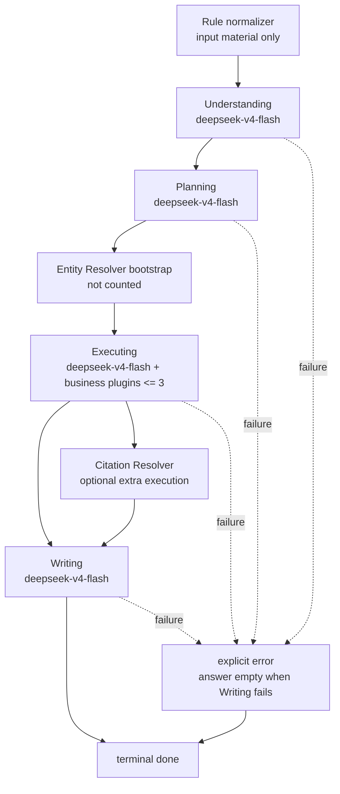

# DeepThink 单模型四阶段实施计划

> **给执行母智能体与子智能体：** 本计划只用于下一轮实现与验收。本轮不要实现代码。执行时必须使用 harness engineering：母智能体只负责编排、验收和归档；按阶段派遣 Explorer、Worker、Reviewer、Verifier。四类子智能体均使用 `medium`，禁止使用 `fast`。步骤使用复选框跟踪。

**目标：** 将 TE-KG DeepThink（DT）改造为 `Understanding -> Planning -> Executing -> Writing` 四阶段流程，四阶段真实调用同一个 `deepseek-v4-flash` 模型，并以严格失败语义替代任何 fallback 或 deterministic final answer。

**架构：** DT 保留规则 normalizer 与现有业务插件能力，但规则 normalizer 只能作为 Understanding 的输入材料，不能再直接决定最终答案。四个阶段必须逐阶段真实调用 `deepseek-v4-flash`，运行时记录完整阶段思考过程、插件执行轨迹和最终答案。任一阶段失败必须显式返回 `error` 并进入 terminal `done`，不得以模板、规则或确定性答案伪装成功。

**技术栈：** PHP 8.x、现有 TE-KG DeepThink service、DeepSeek/OpenAI-compatible relay、browser streaming API、现有业务插件、PHP/Python contract 与 live API 检查。

---

## 0. 锁定需求

以下要求是本计划的硬约束，不得在实现中弱化：

1. DT 只有四个阶段：
   - `Understanding`
   - `Planning`
   - `Executing`
   - `Writing`
2. 四阶段必须分别真实调用同一个模型：`deepseek-v4-flash`。
3. 规则 normalizer 仅作为 Understanding 输入，不得替代 Understanding 模型调用，也不得直接生成最终答案。
4. Planning 选择的业务插件最多 3 个。
5. `Entity Resolver` 是 bootstrap 能力，不计入最多 3 个业务插件。
6. `Citation Resolver` 可在业务插件额度之外额外执行。
7. 任一阶段失败必须返回明确 `error`，随后发送 terminal `done`。
8. 禁止 fallback。
9. 禁止 deterministic final answer。
10. Writing 失败时 `answer` 必须为空。
11. live API 必须记录完整阶段思考过程和答案，供验收审计。
12. 实现完成并通过验收后，将本计划移动到 `docs/exec-plans/completed/deepthink-single-model-four-stage.md`，补充 completion record。

## 1. 非目标

- 不修改 Agent 六阶段 runtime。
- 不修改 Neo4j runtime target；保持 `tekg3`。
- 不修改 taxonomy runtime truth source。
- 不修改 expression runtime 根目录。
- 不修改普通数据库页面、G6 图谱或 path finder。
- 不新增第二套 DT 编排实现。
- 不用兼容性 fallback 保留旧 DT deterministic final answer。

## 2. 目标流程



### 2.1 阶段契约

| 阶段 | 必须真实调用模型 | 输入重点 | 输出重点 | 失败行为 |
|---|---|---|---|---|
| Understanding | `deepseek-v4-flash` | 用户问题、规则 normalizer 输出 | 问题理解、实体需求、回答目标 | `error` + terminal `done` |
| Planning | `deepseek-v4-flash` | Understanding 输出、可用插件目录 | 最多 3 个业务插件的执行计划；bootstrap 与额外 citation 单独标记 | `error` + terminal `done` |
| Executing | `deepseek-v4-flash` | Planning 输出、bootstrap 结果、插件结果 | 执行轨迹、证据整理、缺口与限制 | `error` + terminal `done` |
| Writing | `deepseek-v4-flash` | 前三阶段完整输出、证据、限制 | 最终答案 | `error` + terminal `done`，且 `answer=""` |

### 2.2 插件额度

插件额度必须由运行时强制校验，不能只依赖 prompt：

```text
business_plugins.length <= 3
Entity Resolver: bootstrap, excluded from business_plugins.length
Citation Resolver: optional extra resolver, excluded from business_plugins.length
```

如果 Planning 输出超过 3 个业务插件、使用未知插件或错误地把 resolver 混入业务插件计数，run 必须失败，不得截断队列后继续执行。

### 2.3 严格失败语义

禁止以下行为：

- 阶段模型失败后继续进入下一阶段。
- JSON 解析失败后构造默认阶段结果。
- 插件规划失败后回退到固定插件队列。
- Writing 失败后使用规则模板、插件摘要或 deterministic answer 作为最终答案。
- 先返回成功答案，再用事件隐藏中间阶段失败。

统一失败结果至少应包含：

```json
{
  "status": "error",
  "failed_stage": "Understanding|Planning|Executing|Writing",
  "error": {
    "code": "stable_machine_readable_code",
    "message": "human-readable error",
    "details": {}
  },
  "answer": "",
  "done": true
}
```

`answer` 在 Writing 失败时必须为空。为避免伪成功，其他 terminal error 也建议保持空答案。

## 3. Harness 分工

母智能体不得直接承担探索、编码、审查或验证工作。母智能体只做以下事情：

1. 编排任务顺序。
2. 向子智能体提供锁定需求和文件边界。
3. 接收并核对证据。
4. 拒绝不满足硬约束的实现。
5. 在全部验收通过后归档计划。

所有子智能体均使用 `medium`，禁止使用 `fast`：

| 角色 | 职责 | 必须交付 |
|---|---|---|
| Explorer | 只读探索 DT runtime、stream API、relay、插件目录、测试入口；定位旧 fallback 与 deterministic final answer | 精确文件清单、调用链、风险点、建议测试清单 |
| Worker | 按 Explorer 清单实施最小范围改动；不碰无关文件 | 修改文件列表、行为说明、局部测试结果 |
| Reviewer | 独立检查四阶段真实性、单模型一致性、插件额度、失败语义、live 记录完整性 | 按严重度排序的问题清单；无问题时明确 PASS |
| Verifier | 独立运行静态、contract、failure-path 与 live API 验证 | 命令、退出码、关键证据、最终 PASS/FAIL |

如果 Reviewer 或 Verifier 发现问题，母智能体必须重新派 Worker 修复，并再次派 Reviewer 与 Verifier 验收。禁止母智能体自行跳过失败项。

## 4. 文件范围确认

实现前由 Explorer 只读确认精确文件范围。优先检查：

- `api/agent/orchestrator/DeepThinkService.php`
- `api/agent/orchestrator/LlmClient.php`
- `api/agent/orchestrator/EntityNormalizer.php`
- `api/agent/orchestrator/traits/DeepThinkRoutingTrait.php`
- `api/agent/orchestrator/traits/DeepThinkEvidenceTrait.php`
- `api/deep_think_stream.php`
- `api/agent/bootstrap.php`
- `scripts/llm_relay.py`
- 现有 DT contract、relay 与 live API 测试

Explorer 必须确认：

- 当前 DT 是否存在规则 shortcut。
- 当前 DT 是否存在 deterministic final answer。
- 当前 DT 如何调用模型、模型名从哪里解析。
- 当前 stream API 如何发出 thinking、answer、error、done。
- 当前业务插件目录、resolver 名称与插件执行入口。
- 当前 live API 日志能否持久记录四阶段完整过程与答案。

只有 Explorer 返回精确清单后，Worker 才能修改文件。不要预先扩大到 Agent、图谱、taxonomy、expression 或页面 UI。

## 5. 实施任务

### Task 1：锁定四阶段 contract 与失败 contract

- [ ] Explorer 定位当前 DT stage、stream event 与错误处理入口。
- [ ] Worker 增加或更新 contract 测试，断言 DT 仅有四阶段且顺序固定。
- [ ] Worker 增加失败测试，覆盖任一阶段失败后 `error` + terminal `done`。
- [ ] Worker 增加 Writing 失败测试，断言最终 `answer` 为空。
- [ ] Reviewer 确认不存在 fallback 或 deterministic final answer 成功路径。

最低断言：

```text
stages == [Understanding, Planning, Executing, Writing]
failed_stage stops later stages
terminal event == done
Writing failure => answer == ""
```

### Task 2：将四阶段绑定到同一个真实模型调用

- [ ] Explorer 确认 `deepseek-v4-flash` 的配置解析和 relay 调用链。
- [ ] Worker 让 Understanding、Planning、Executing、Writing 分别真实调用 `deepseek-v4-flash`。
- [ ] Worker 增加 spy/fake transport contract 测试，断言每个成功 run 恰好包含四个阶段级模型调用，且每次 model 都是 `deepseek-v4-flash`。
- [ ] Worker 禁止阶段调用静默切换其他模型。
- [ ] Reviewer 检查模型名不是仅写入 metadata，而是真正传给 relay/API。

### Task 3：限制规则 normalizer 的边界

- [ ] Explorer 定位 normalizer 结果当前如何影响 routing、shortcut 和 answer。
- [ ] Worker 将 normalizer 输出限制为 Understanding prompt/input payload 的一部分。
- [ ] Worker 删除或禁用 normalizer 直接完成回答的路径。
- [ ] Worker 增加测试：即使 normalizer 命中简单问题，也必须进入 Understanding 模型调用。
- [ ] Reviewer 检查 DT 不再保留规则 shortcut 最终答案。

### Task 4：实现插件规划额度与 resolver 例外

- [ ] Explorer 列出业务插件、`Entity Resolver`、`Citation Resolver` 的真实 runtime 名称和入口。
- [ ] Worker 在 Planning 输出校验层强制 `business_plugins.length <= 3`。
- [ ] Worker 将 `Entity Resolver` 作为 bootstrap 执行，不计入业务插件额度。
- [ ] Worker 允许 `Citation Resolver` 在业务插件额度外额外执行。
- [ ] Worker 增加测试：3 个业务插件通过；4 个业务插件失败；Entity Resolver 不占额度；Citation Resolver 可额外执行；未知插件失败。
- [ ] Reviewer 检查额度由代码强制执行，不只是 prompt 约束。

### Task 5：移除 fallback 与 deterministic final answer

- [ ] Explorer 全局定位 DT 相关 fallback、默认 payload、模板答案和 deterministic answer。
- [ ] Worker 删除或禁用所有 DT fallback 式成功路径。
- [ ] Worker 将模型错误、relay 错误、解析错误、schema 错误、插件额度错误和插件执行错误统一映射为显式 terminal error。
- [ ] Worker 确保失败后不继续调用后续阶段。
- [ ] Reviewer 逐项检查失败路径，没有任何“失败但返回 answer”的情况。

### Task 6：补齐 live API 完整记录

- [ ] Explorer 确认 live API 当前日志位置、事件格式和答案记录位置。
- [ ] Worker 让 live API 对每次 run 记录四阶段完整思考过程、模型调用阶段、插件执行轨迹、错误或最终答案。
- [ ] Worker 确保成功 run 可审计四阶段全过程和 answer。
- [ ] Worker 确保失败 run 可审计 `failed_stage`、错误和 terminal `done`。
- [ ] Reviewer 检查日志记录的是实际运行产物，不是伪造摘要。

live 验收记录至少包含：

```text
run_id
model == deepseek-v4-flash
Understanding process
Planning process
Executing process
Writing process
selected business plugins
Entity Resolver bootstrap trace
Citation Resolver trace when used
error when failed
answer when successful
terminal done
```

### Task 7：独立验证与归档

- [ ] Verifier 运行 Explorer 确认后的 PHP lint、contract tests、failure-path tests 和 relay tests。
- [ ] Verifier 通过 live API 执行至少一个成功样本。
- [ ] Verifier 通过可控故障执行至少一个失败样本，并确认 `error` + terminal `done`。
- [ ] Verifier 检查成功样本的完整思考过程和答案均已记录。
- [ ] Verifier 检查 Writing 失败样本的 `answer` 为空。
- [ ] Reviewer 复核 Verifier 证据。
- [ ] 母智能体将本计划移动到 `docs/exec-plans/completed/deepthink-single-model-four-stage.md`，写入实际修改文件、验证命令、结果和剩余风险。

## 6. 最低验证矩阵

| 场景 | 预期 |
|---|---|
| 正常简单问题 | 仍真实执行四阶段模型调用，不走 normalizer shortcut |
| 正常研究问题 | 四阶段均调用 `deepseek-v4-flash`，记录完整过程与 answer |
| Planning 选择 3 个业务插件 | 通过 |
| Planning 选择 4 个业务插件 | 显式 `error` + terminal `done` |
| 3 个业务插件 + Entity Resolver | 通过，Entity Resolver 不计数 |
| 3 个业务插件 + Citation Resolver | 通过，Citation Resolver 可额外执行 |
| Understanding 模型失败 | 显式 `error` + terminal `done`，不进入 Planning |
| Planning 模型失败 | 显式 `error` + terminal `done`，不进入 Executing |
| Executing 模型或插件失败 | 显式 `error` + terminal `done`，不进入 Writing |
| Writing 模型失败 | 显式 `error` + terminal `done`，`answer=""` |
| relay 返回 malformed JSON | 显式 `error` + terminal `done`，无 fallback |

## 7. 验收标准

实现完成后必须同时满足：

- DT runtime 只有 `Understanding -> Planning -> Executing -> Writing` 四阶段。
- 四阶段均真实调用同一个 `deepseek-v4-flash`。
- normalizer 只作为 Understanding 输入。
- 业务插件最多 3 个，且由代码强制校验。
- Entity Resolver bootstrap 不计入业务插件额度。
- Citation Resolver 可在额度之外额外执行。
- 任一阶段失败均显式 `error` + terminal `done`。
- 无 fallback。
- 无 deterministic final answer。
- Writing 失败时答案为空。
- live API 记录完整阶段思考过程与答案。
- Reviewer 与 Verifier 均给出 PASS。
- 完成后计划已移入 `docs/exec-plans/completed/` 并写入 completion record。

## 8. 停止条件

遇到以下情况必须停止扩大修改范围，并由母智能体汇报：

- 需要修改 Agent 六阶段 runtime 才能完成 DT 改造。
- 需要修改 Neo4j、taxonomy、expression、G6 或普通页面。
- relay 无法区分阶段级调用，导致无法证明四阶段真实调用同一模型。
- live API 无法记录完整阶段过程和 answer，且修复需要超出 DT/relay/logging 边界。
- 现有未提交改动与本任务产生直接冲突，无法在不覆盖他人改动的前提下继续。

