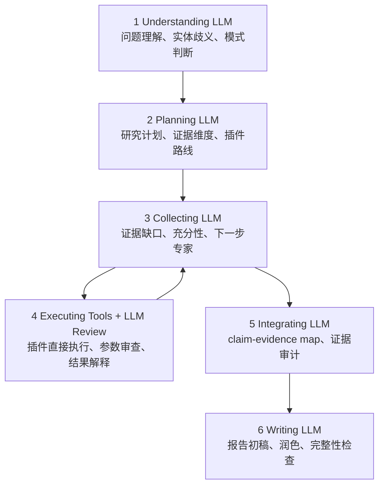

# LLM 增强六阶段 Agent 实施计划

> **给执行母智能体与子智能体：** 本计划只用于下一轮对话执行。本轮不要实现代码。执行时必须使用 harness engineering：母智能体统筹，按任务派 Worker/Reviewer/Verifier 子智能体；子智能体默认 medium，不使用 high，除非用户明确要求。步骤使用复选框跟踪。

**目标：** 将 TE-KG Agent 从“六阶段 workflow 状态机”升级为“六阶段 LLM 增强研究型 Agent”，每个阶段都有 LLM 参与理解、计划、审查、解释或写作，并产生可审计结构化产物；但插件执行本身不强制调用 LLM，Graph Analytics、Sequence、Expression 等确定性插件仍可直接运行。不得使用 fallback 掩盖 JSON、prompt、schema、插件或写作错误。

**架构：** 保留现有 Agent 六阶段外壳：`Understanding -> Planning -> Collecting -> Executing -> Integrating -> Writing`。新增集中式六阶段 LLM 增强层，每个阶段都有独立 prompt、输入 payload、JSON schema、运行记录、失败暴露和前端展示事件。当前规则/插件结果可作为输入材料；Executing 阶段中，LLM 负责工具参数审查、复杂工具辅助、结果解释和证据可用性判断，不替代确定性插件执行。

**技术栈：** PHP 8.x、现有 TE-KG Agent PHP runtime、DeepSeek/OpenAI-compatible relay、JSON schema-style contracts、browser JS、现有 Python/PHP 测试脚本。

---

## 0. 当前问题与目标边界

当前 Agent 的六阶段不是六个 LLM 节点：

- `Understanding` 主要是规则实体/意图分析。
- `Planning` 主要是规则插件计划。
- `Collecting` 主要是证据调度状态。
- `Executing` 主要是插件执行；部分插件可能调用 LLM，Graph Analytics 不调用 LLM。
- `Integrating` 主要是 deterministic evidence package / evidence walk / report plan，部分路径可能调用 LLM。
- `Writing` 明确调用 LLM draft 和 polish。

本计划目标不是优化成本，也不是优化耗时。用户明确要求：

- 不要在意成本。
- 不要在意时间。
- JSON 出错就暴露并修复。
- 遇到 bug 就彻底修，不用 fallback 掩盖。
- 六阶段都必须有大模型参与，但“参与”不等于每个插件调用都必须经过大模型；确定性插件可以直接执行，LLM 负责该阶段的决策、审查或解释产物。

因此本计划采用“阶段级 LLM 增强产物 + 严格 schema + 失败显式终止”的实现策略。LLM 增强产物失败时不静默兜底；确定性插件执行失败时按插件必需性显式记录或终止。

非目标：

- 不修改 Neo4j runtime target。
- 不改 taxonomy runtime truth source。
- 不改 expression runtime 根目录。
- 不处理非 Agent/DT 智能问答页面视觉问题。
- 不把 DT 改成六阶段 Agent。

---

## 1. 目标架构

### 1.1 六阶段新定义



### 1.2 每阶段必须产生产物

| 阶段 | 必须输出 | 是否允许 fallback |
|---|---|---|
| Understanding | `understanding_result.v1` | 不允许 |
| Planning | `research_plan.v1` | 不允许 |
| Collecting | `collection_decision.v1` | 不允许 |
| Executing | 插件结果 + `tool_execution_review.v1` | 插件调用不强制 LLM；LLM review 不允许静默失败 |
| Integrating | `claim_evidence_map.v1` | 不允许 |
| Writing | `draft_report.v1` + `polished_report.v1` | 不允许 |

### 1.3 错误策略

本阶段不使用静默兜底：

- LLM 返回非 JSON：run 失败，记录原始输出片段、节点名、request id。
- JSON 缺字段：run 失败，记录 schema violation。
- LLM 超时：run 失败，记录 timeout。
- 必需插件失败：run 失败。
- optional 插件失败：必须进入 evidence gap，不得忽略。
- Executing 阶段的确定性插件不需要大模型包裹；但插件结果进入下一步前必须经过 LLM review 或明确标记为无需 review 的 schema 字段。
- integrity gate 失败：run 失败，不返回伪成功答案。

---

## 2. 文件规划

### 新增文件

- `api/agent/contracts/NodeLlmResult.php`  
  统一封装六阶段 LLM 节点结果、错误、schema 校验结果。

- `api/agent/config/agent_node_prompts.php`  
  集中管理六阶段 LLM prompt，支持中文/英文分支。

- `api/agent/config/agent_node_schemas.php`  
  集中管理六阶段 JSON schema-style contract。

- `test/agent_six_stage_llm_contract_test.php`  
  覆盖 prompt、schema、节点输出验证、错误暴露。

- `test/agent_six_stage_runtime_test.php`  
  覆盖 Agent service 是否产生六阶段 LLM 增强产物；Executing 阶段允许确定性插件直接运行，但必须有工具结果审查产物或显式 no-review reason。

### 修改文件

- `api/agent/orchestrator/LlmClient.php`  
  增加六阶段 LLM 增强调用方法，返回 raw + parsed + validation。

- `api/agent/orchestrator/AcademicAgentService.php`  
  将现有规则结果和插件结果作为输入材料，插入六阶段 LLM 增强产物生成。

- `api/agent/orchestrator/traits/AcademicAgentWorkflowTrait.php`  
  扩展 workflow event payload，展示每个 LLM 节点产物摘要。

- `api/agent/orchestrator/traits/AcademicAgentEvidenceTrait.php`  
  将 collecting/integrating 的 LLM 输出接入 evidence package 与 claim-evidence map。

- `assets/js/pages/agent.js`  
  展示六阶段 LLM 节点产物、错误、schema violation；避免完成态被旧 state 覆盖。

- `docs/RELIABILITY.md`  
  记录新验证命令、风险、live eval 需要重跑。

---

## 3. 任务分解

### Task 1：建立六阶段 LLM schema 与 prompt 契约

**文件：**

- Create: `api/agent/config/agent_node_schemas.php`
- Create: `api/agent/config/agent_node_prompts.php`
- Create: `api/agent/contracts/NodeLlmResult.php`
- Test: `test/agent_six_stage_llm_contract_test.php`

- [ ] **Step 1：写失败测试**

测试必须断言：

- 六个节点 schema 都存在。
- 六个节点 prompt 都有中文和英文分支。
- 缺字段会返回 schema violation。
- 非 JSON 会返回 parse error。
- 不存在 fallback 成功路径。

运行：

```powershell
php test\agent_six_stage_llm_contract_test.php
```

预期：失败，因为文件和类还不存在。

- [ ] **Step 2：实现 schema 文件**

`agent_node_schemas.php` 至少定义：

- `understanding_result.v1`
- `research_plan.v1`
- `collection_decision.v1`
- `tool_execution_review.v1`
- `claim_evidence_map.v1`
- `writing_decision.v1`

每个 schema 必须有：

- `version`
- `required`
- `properties`
- `stage`

- [ ] **Step 3：实现 prompt 文件**

每个节点 prompt 必须明确：

- 只返回 JSON。
- 不使用 Markdown fence。
- 不输出 JSON 之外解释。
- 中文问题返回中文内容，但字段名保持英文。
- 不允许编造 PMID、URL、图谱边、站内路径。

- [ ] **Step 4：实现 NodeLlmResult**

该类负责：

- 保存 `stage`
- 保存 `raw_text`
- 保存 `parsed_json`
- 保存 `ok`
- 保存 `errors`
- 保存 `schema_version`
- 提供 `validateAgainstSchema()`

- [ ] **Step 5：运行测试**

```powershell
php test\agent_six_stage_llm_contract_test.php
php -l api\agent\contracts\NodeLlmResult.php
php -l api\agent\config\agent_node_prompts.php
php -l api\agent\config\agent_node_schemas.php
```

预期：全部通过。

---

### Task 2：扩展 LlmClient，增加六阶段 LLM 增强调用

**文件：**

- Modify: `api/agent/orchestrator/LlmClient.php`
- Test: `test/agent_six_stage_llm_contract_test.php`

- [ ] **Step 1：写失败测试**

测试通过 fake LLM response 覆盖：

- `runUnderstandingNode()`
- `runPlanningNode()`
- `runCollectingNode()`
- `runExecutingReviewNode()`
- `runIntegratingNode()`
- `runWritingDecisionNode()`

每个方法必须返回 `NodeLlmResult`。

- [ ] **Step 2：实现方法**

方法命名建议：

```php
runSixStageNode(string $stage, string $model, string $language, array $payload, int $timeout): NodeLlmResult
```

并提供阶段专用 wrapper：

```php
runUnderstandingNode(...)
runPlanningNode(...)
runCollectingNode(...)
runExecutingReviewNode(...)
runIntegratingNode(...)
runWritingDecisionNode(...)
```

- [ ] **Step 3：禁止静默 fallback**

如果 JSON 解析失败或 schema 校验失败：

- 返回 `ok=false`。
- 不构造默认成功 JSON。
- 上层必须把 run 标为失败。

- [ ] **Step 4：运行测试**

```powershell
php test\agent_six_stage_llm_contract_test.php
php -l api\agent\orchestrator\LlmClient.php
```

---

### Task 3：改造 AcademicAgentService，使六阶段产生 LLM 增强产物

**文件：**

- Modify: `api/agent/orchestrator/AcademicAgentService.php`
- Modify: `api/agent/orchestrator/traits/AcademicAgentWorkflowTrait.php`
- Test: `test/agent_six_stage_runtime_test.php`

- [ ] **Step 1：写失败测试**

测试必须模拟一次 Agent run，并断言：

- Understanding LLM 增强被调用。
- Planning LLM 增强被调用。
- Collecting LLM 增强被调用至少一次。
- Executing 阶段插件可以直接执行，但插件结果进入后续阶段前必须产生 `tool_execution_review.v1`，或产生 schema 化 `review_not_required_reason`。
- Integrating LLM 增强被调用。
- Writing decision LLM 增强被调用。
- 任一必需 LLM 增强产物 `ok=false` 时 run 失败，不进入后续节点。

- [ ] **Step 2：插入 Understanding LLM**

规则分析仍可先跑，但必须作为 input：

```text
question + deterministic_analysis + session_memory -> Understanding LLM
```

输出 `understanding_result.v1`。

- [ ] **Step 3：插入 Planning LLM**

输入：

```text
question + understanding_result + deterministic_plugin_candidates
```

输出 `research_plan.v1`。

插件队列必须由 LLM plan 审查并确认，由 schema 限制允许插件名；确定性 planner 可提供候选插件，但不能绕过 LLM plan 审查。

- [ ] **Step 4：插入 Collecting LLM**

每轮插件前后都调用：

```text
current_evidence + active_gaps + remaining_plugins
```

输出：

```text
is_sufficient, missing_dimensions, next_plugin, stop_reason
```

如果 JSON 失败，run 失败。

- [ ] **Step 5：插入 Executing review LLM**

每个插件执行后调用 review，除非该插件在 schema 中明确声明 `review_not_required=true` 并给出 reason：

```text
plugin_name + plugin_input + plugin_result_envelope
```

输出：

```text
usable, evidence_summary, caveats, normalized_findings
```

如果插件结果为空或失败，LLM review 必须显式标注；不得静默忽略。Graph Analytics、Sequence、Expression、Genome 这类确定性插件可以不调用 LLM 来“执行插件”，但它们的输出仍需要被审查、解释或明确记录为无需审查。

- [ ] **Step 6：插入 Integrating LLM**

在 deterministic evidence package / evidence walk 后调用：

```text
evidence_package + evidence_walk + report_plan
```

输出 `claim_evidence_map.v1`。

- [ ] **Step 7：插入 Writing decision LLM**

在 draft/polish 前调用：

```text
claim_evidence_map + report_plan + limitations
```

输出：

```text
writing_strategy, required_sections, forbidden_claims
```

- [ ] **Step 8：运行测试**

```powershell
php test\agent_six_stage_runtime_test.php
php test\agent_prompt_language_test.php
php test\agent_research_report_prompt_test.php
php -l api\agent\orchestrator\AcademicAgentService.php
php -l api\agent\orchestrator\traits\AcademicAgentWorkflowTrait.php
```

---

### Task 4：前端展示六阶段 LLM 产物与错误

**文件：**

- Modify: `assets/js/pages/agent.js`
- Modify: `assets/css/pages/agent.css`

- [ ] **Step 1：写前端 mock 验证脚本或扩展现有 Playwright 检查**

模拟事件：

- `stage_state`
- `node_llm_result`
- `node_llm_error`
- `done`

断言：

- 每个阶段显示 LLM 节点摘要。
- LLM 节点失败时对应阶段显示 error。
- 完成后不会卡在 Executing。
- Agent 模式标题显示 `Agent thinking`。

- [ ] **Step 2：扩展事件处理**

`agent.js` 需要支持：

- `node_llm_result`
- `node_llm_error`

展示内容：

- stage
- schema version
- short summary
- validation status
- raw error excerpt

- [ ] **Step 3：保留状态单调性**

不得允许旧 `workflow_state` 覆盖更靠后的状态。

- [ ] **Step 4：运行验证**

```powershell
node --check assets\js\pages\agent.js
php -l agent.php
```

如果存在浏览器 mock 检查：

```powershell
python scripts/checks/check_agent_workflow_ui.py
```

---

### Task 5：移除 fallback 式成功路径，改成显式失败

**文件：**

- Modify: `api/agent/orchestrator/AcademicAgentService.php`
- Modify: `api/agent/orchestrator/LlmClient.php`
- Modify: related tests

- [ ] **Step 1：列出所有当前 fallback**

必须检查：

- JSON parse fallback。
- answer structure fallback。
- sufficiency fallback。
- compact preflight 是否仍允许跳过六阶段。
- writing draft/polish fallback。

- [ ] **Step 2：按用户目标调整**

本计划要求 Agent research mode 不用 fallback 掩盖失败。简单问题可以在进入 Agent 前被 DT 边界拦截；一旦进入六阶段 Agent，则任何必需 LLM 增强产物失败都应该暴露为 run failure。optional 插件失败可以进入 evidence gap，但不能被当作成功证据。

- [ ] **Step 3：更新测试**

新增断言：

- malformed JSON -> failed run。
- missing required field -> failed run。
- LLM timeout -> failed run。
- plugin required but failed -> failed run。
- integrity gate failed -> failed run。

- [ ] **Step 4：运行回归**

```powershell
php test\agent_six_stage_runtime_test.php
php test\agent_simple_preflight_gate_test.php
php test\agent_evaluation_report_runtime_test.php
```

---

### Task 6：重新评估计划

**文件：**

- Modify: `docs/RELIABILITY.md`
- Possibly create: `docs/exec-plans/completed/llm-augmented-six-stage-agent.md`

- [ ] **Step 1：静态/单元测试**

必须通过：

```powershell
php test\agent_six_stage_llm_contract_test.php
php test\agent_six_stage_runtime_test.php
php test\agent_prompt_language_test.php
php test\agent_research_report_prompt_test.php
php test\agent_simple_preflight_gate_test.php
node --check assets\js\pages\agent.js
php -l agent.php
```

- [ ] **Step 2：live canary**

执行前必须确保 WAMP/本地服务可访问。

```powershell
python scripts\eval\run_dt_agent_live_eval.py --base-url http://127.0.0.1/TE- --case-id P5A_B_005 --out-dir docs\eval\runs\phase6a_canary_P5A_B_005 --timeout 600 --poll-interval 2
python scripts\eval\run_dt_agent_live_eval.py --base-url http://127.0.0.1/TE- --case-id P5A_B_029 --out-dir docs\eval\runs\phase6a_canary_P5A_B_029 --timeout 600 --poll-interval 2
python scripts\eval\run_dt_agent_live_eval.py --base-url http://127.0.0.1/TE- --case-id P5A_B_001 --out-dir docs\eval\runs\phase6a_canary_P5A_B_001 --timeout 600 --poll-interval 2
```

- [ ] **Step 3：研究型样本 live canary**

至少加入：

- graph ranking
- mechanism review
- research report
- evidence audit

使用 golden cases 中对应 case id。

- [ ] **Step 4：完整 30 case 评估**

```powershell
python scripts\eval\run_dt_agent_live_eval.py --base-url http://127.0.0.1/TE- --out-dir docs\eval\runs\phase6a_full --timeout 900 --poll-interval 2
python scripts\eval\run_dt_agent_live_eval.py --rescore-existing --semantic-proxy --out-dir docs\eval\runs\phase6a_full
python scripts\eval\semantic_eval.py --run-dir docs\eval\runs\phase6a_full
```

- [ ] **Step 5：比较 Phase 5C 与 Phase 6A**

必须报告：

- Agent success rate
- Agent failure reasons
- Agent overkill
- latency
- semantic winner
- claim support score
- citation relevance score
- missing-evidence handling score
- research usefulness score
- 中文问题语言一致性
- UI workflow 是否仍跳跃或卡住

---

## 4. 验收标准

实现完成后必须满足：

- 六阶段每阶段都有 LLM 增强产物；Executing 阶段不强制每个插件调用大模型，但必须对工具结果做 LLM review 或 schema 化 no-review 说明。
- 每阶段都有结构化 JSON 产物。
- 每阶段产物进入 run event 和最终 response。
- malformed JSON 不会被 fallback 掩盖。
- schema violation 不会被 fallback 掩盖。
- Agent 页面能展示每阶段 LLM 产物或错误。
- 完成后 workflow 不会卡在 Executing。
- 中文问题走中文 prompt，英文问题走英文 prompt。
- Phase 6A live eval 重新完成，不沿用 Phase 5C 结论。

---

## 5. 执行顺序建议

1. 先做 schema/prompt/contracts。
2. 再做 LlmClient 节点调用。
3. 再把 AcademicAgentService 串起来。
4. 再做前端展示。
5. 再移除 fallback 式成功路径。
6. 最后做静态测试、canary、完整评估和文档归档。

不要先改 UI 假装六阶段存在。必须先让后端真实产出六阶段 LLM 节点事件。
