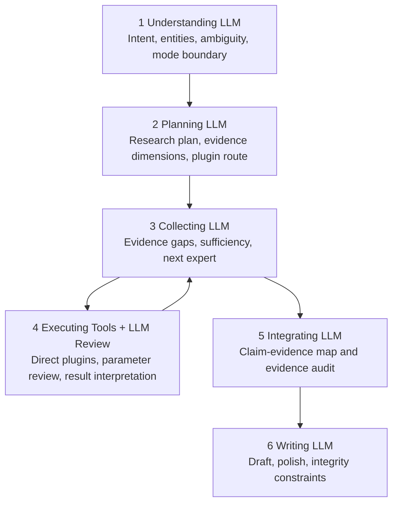

# LLM-Augmented Six-Stage Agent Implementation Plan

> **For agentic workers:** REQUIRED EXECUTION STYLE: use harness engineering. The coordinator must dispatch Worker, Reviewer, and Verifier subagents task-by-task. Default subagent reasoning is medium. Do not use high reasoning unless the user explicitly requests it. Steps use checkbox (`- [ ]`) syntax for tracking.

**Goal:** Upgrade the TE-KG Agent from a six-stage workflow state machine into a six-stage LLM-augmented research agent where every stage has LLM participation through understanding, planning, review, interpretation, synthesis, or writing artifacts. Plugin execution itself is not forced through an LLM: deterministic tools such as Graph Analytics, Sequence, Expression, and Genome may still run directly.

**Architecture:** Preserve the current outer stage sequence: `Understanding -> Planning -> Collecting -> Executing -> Integrating -> Writing`. Add a stage-level LLM augmentation layer with dedicated prompts, payloads, schema contracts, run records, explicit failures, and frontend events. Existing deterministic rules and plugin results may be used as inputs. In Executing, the LLM reviews tool parameters, assists complex tools, interprets results, and judges evidence usability; it does not replace deterministic plugin execution.

**Tech Stack:** PHP 8.x, existing TE-KG Agent runtime, DeepSeek/OpenAI-compatible relay, schema-style PHP contracts, browser JavaScript, existing PHP/Python test harnesses.

---

## 0. Current State and Scope

The current Agent stages are not six LLM nodes:

- `Understanding` is mostly deterministic entity and intent analysis.
- `Planning` is mostly deterministic plugin planning.
- `Collecting` is mostly a coordination state.
- `Executing` runs plugins; some plugins may use LLM, Graph Analytics does not.
- `Integrating` mostly builds deterministic evidence package, evidence walk, and report plan.
- `Writing` clearly uses LLM for draft and polish.

The user explicitly wants:

- Ignore cost.
- Ignore latency.
- If JSON breaks, expose it and fix it.
- If bugs appear, fix them directly.
- Do not use fallback to hide failures.
- Every stage must involve an LLM, but involvement does not mean every plugin call must use an LLM. Deterministic plugins may execute directly; the LLM provides decision, review, or interpretation artifacts for the stage.

This plan therefore uses stage-level LLM augmentation artifacts, strict schema validation, and explicit run failure when required LLM artifacts fail. Deterministic plugin failures are handled by required/optional plugin policy and must never be silently ignored.

Non-goals:

- Do not modify Neo4j runtime target.
- Do not modify taxonomy runtime truth source.
- Do not modify expression runtime root.
- Do not work on unrelated visual issues outside Agent/DT pages.
- Do not convert Deep Think into a six-stage Agent.

---

## 1. Target Architecture



Each stage must emit an auditable artifact:

| Stage | Required Artifact | Fallback Allowed |
|---|---|---|
| Understanding | `understanding_result.v1` | No |
| Planning | `research_plan.v1` | No |
| Collecting | `collection_decision.v1` | No |
| Executing | plugin result plus `tool_execution_review.v1` | Plugin calls are not forced through LLM; LLM review must not silently fail |
| Integrating | `claim_evidence_map.v1` | No |
| Writing | `draft_report.v1` and `polished_report.v1` | No |

Failure policy:

- Non-JSON LLM output: fail the run and record stage, request id, and raw excerpt.
- Missing required fields: fail the run with schema violation.
- LLM timeout: fail the run with timeout.
- Required plugin failure: fail the run.
- Optional plugin failure: record an explicit evidence gap; do not ignore it.
- Deterministic plugins in Executing do not need an LLM wrapper to run. Before their outputs enter downstream stages, they must either receive an LLM review or provide a schema-level `review_not_required_reason`.
- Integrity gate failure: fail the run; do not return false success.

---

## 2. File Plan

Create:

- `api/agent/contracts/NodeLlmResult.php`  
  Encapsulates LLM node raw output, parsed output, schema validation, and errors.

- `api/agent/config/agent_node_prompts.php`  
  Centralized bilingual prompts for all six LLM nodes.

- `api/agent/config/agent_node_schemas.php`  
  Centralized schema-style contracts for all node artifacts.

- `test/agent_six_stage_llm_contract_test.php`  
  Tests prompt availability, schema validation, JSON parse errors, and no-fallback behavior.

- `test/agent_six_stage_runtime_test.php`  
  Tests that the Agent service produces six-stage LLM augmentation artifacts. Executing may run deterministic plugins directly, but must produce a tool review artifact or an explicit no-review reason.

Modify:

- `api/agent/orchestrator/LlmClient.php`  
  Add six-stage LLM augmentation calls.

- `api/agent/orchestrator/AcademicAgentService.php`  
  Insert six-stage LLM augmentation artifact generation into the existing flow.

- `api/agent/orchestrator/traits/AcademicAgentWorkflowTrait.php`  
  Emit richer stage events for LLM node artifacts and errors.

- `api/agent/orchestrator/traits/AcademicAgentEvidenceTrait.php`  
  Connect collecting and integrating LLM outputs to evidence package and claim-evidence map.

- `assets/js/pages/agent.js`  
  Render six-stage LLM artifacts and errors.

- `docs/RELIABILITY.md`  
  Record verification commands, risks, and required re-evaluation.

---

## 3. Tasks

### Task 1: Add Six-Stage LLM Schemas and Prompts

**Files:**

- Create: `api/agent/config/agent_node_schemas.php`
- Create: `api/agent/config/agent_node_prompts.php`
- Create: `api/agent/contracts/NodeLlmResult.php`
- Test: `test/agent_six_stage_llm_contract_test.php`

- [ ] **Step 1: Write the failing contract test**

The test must assert:

- All six schemas exist.
- All six prompts have Chinese and English branches.
- Missing required fields produce schema violations.
- Non-JSON output produces parse errors.
- There is no fallback success path.

Run:

```powershell
php test\agent_six_stage_llm_contract_test.php
```

Expected: FAIL because the files/classes do not exist yet.

- [ ] **Step 2: Implement node schemas**

Define at least:

- `understanding_result.v1`
- `research_plan.v1`
- `collection_decision.v1`
- `tool_execution_review.v1`
- `claim_evidence_map.v1`
- `writing_decision.v1`

Each schema must define:

- `version`
- `stage`
- `required`
- `properties`

- [ ] **Step 3: Implement bilingual node prompts**

Every prompt must require:

- JSON only.
- No Markdown fences.
- No text outside JSON.
- Chinese content for Chinese questions, but English field names.
- No invented PMID, URL, graph edge, or internal route.

- [ ] **Step 4: Implement NodeLlmResult**

The class must store:

- `stage`
- `raw_text`
- `parsed_json`
- `ok`
- `errors`
- `schema_version`

It must provide schema validation with explicit error messages.

- [ ] **Step 5: Verify**

```powershell
php test\agent_six_stage_llm_contract_test.php
php -l api\agent\contracts\NodeLlmResult.php
php -l api\agent\config\agent_node_prompts.php
php -l api\agent\config\agent_node_schemas.php
```

---

### Task 2: Add Six-Stage LLM Augmentation Calls to LlmClient

**Files:**

- Modify: `api/agent/orchestrator/LlmClient.php`
- Test: `test/agent_six_stage_llm_contract_test.php`

- [ ] **Step 1: Write failing tests**

Test fake LLM responses for:

- `runUnderstandingNode()`
- `runPlanningNode()`
- `runCollectingNode()`
- `runExecutingReviewNode()`
- `runIntegratingNode()`
- `runWritingDecisionNode()`

Each method must return `NodeLlmResult`.

- [ ] **Step 2: Implement generic node runner**

Recommended core method:

```php
runSixStageNode(string $stage, string $model, string $language, array $payload, int $timeout): NodeLlmResult
```

Add stage-specific wrappers.

- [ ] **Step 3: Enforce no fallback**

If parse or validation fails:

- return `ok=false`;
- keep raw output;
- do not synthesize a successful default JSON result.

- [ ] **Step 4: Verify**

```powershell
php test\agent_six_stage_llm_contract_test.php
php -l api\agent\orchestrator\LlmClient.php
```

---

### Task 3: Wire Six-Stage LLM Augmentation Artifacts into AcademicAgentService

**Files:**

- Modify: `api/agent/orchestrator/AcademicAgentService.php`
- Modify: `api/agent/orchestrator/traits/AcademicAgentWorkflowTrait.php`
- Test: `test/agent_six_stage_runtime_test.php`

- [ ] **Step 1: Write failing runtime tests**

The test must assert:

- Understanding LLM augmentation is called.
- Planning LLM augmentation is called.
- Collecting LLM augmentation is called at least once.
- Executing may run deterministic plugins directly, but plugin outputs must produce `tool_execution_review.v1` or a schema-level `review_not_required_reason` before downstream use.
- Integrating LLM augmentation is called.
- Writing decision LLM augmentation is called.
- If any required LLM artifact returns `ok=false`, the run fails and later nodes do not run.

- [ ] **Step 2: Insert Understanding LLM**

Input:

```text
question + deterministic_analysis + session_memory
```

Output: `understanding_result.v1`.

- [ ] **Step 3: Insert Planning LLM**

Input:

```text
question + understanding_result + deterministic_plugin_candidates
```

Output: `research_plan.v1`.

Plugin queue must be reviewed and confirmed by the LLM plan and schema-constrained to known plugin names. The deterministic planner may provide candidates, but it must not bypass LLM plan review.

- [ ] **Step 4: Insert Collecting LLM**

Run before and after plugin execution rounds.

Input:

```text
current_evidence + active_gaps + remaining_plugins
```

Output:

```text
is_sufficient, missing_dimensions, next_plugin, stop_reason
```

- [ ] **Step 5: Insert Executing Review LLM**

After each plugin execution, call review unless the plugin declares `review_not_required=true` in schema and provides a reason:

```text
plugin_name + plugin_input + plugin_result_envelope
```

Output:

```text
usable, evidence_summary, caveats, normalized_findings
```

- [ ] **Step 6: Insert Integrating LLM**

After deterministic evidence package and evidence walk:

```text
evidence_package + evidence_walk + report_plan
```

Output: `claim_evidence_map.v1`.

- [ ] **Step 7: Insert Writing Decision LLM**

Before draft/polish:

```text
claim_evidence_map + report_plan + limitations
```

Output:

```text
writing_strategy, required_sections, forbidden_claims
```

- [ ] **Step 8: Verify**

```powershell
php test\agent_six_stage_runtime_test.php
php test\agent_prompt_language_test.php
php test\agent_research_report_prompt_test.php
php -l api\agent\orchestrator\AcademicAgentService.php
php -l api\agent\orchestrator\traits\AcademicAgentWorkflowTrait.php
```

---

### Task 4: Render Six-Stage LLM Artifacts in the Frontend

**Files:**

- Modify: `assets/js/pages/agent.js`
- Modify: `assets/css/pages/agent.css`

- [ ] **Step 1: Add or extend a frontend mock check**

Simulate:

- `stage_state`
- `node_llm_result`
- `node_llm_error`
- `done`

Assert:

- each stage displays an LLM summary;
- node failure marks the stage as error;
- completed runs do not remain stuck at Executing;
- Agent title is `Agent thinking`.

- [ ] **Step 2: Extend event handling**

Support event types:

- `node_llm_result`
- `node_llm_error`

Render:

- stage;
- schema version;
- short summary;
- validation status;
- raw error excerpt.

- [ ] **Step 3: Preserve monotonic workflow state**

Old `workflow_state` must not overwrite later UI state.

- [ ] **Step 4: Verify**

```powershell
node --check assets\js\pages\agent.js
php -l agent.php
```

---

### Task 5: Remove Fallback-Style Success Paths for Six-Stage Agent

**Files:**

- Modify: `api/agent/orchestrator/AcademicAgentService.php`
- Modify: `api/agent/orchestrator/LlmClient.php`
- Modify: tests as needed

- [ ] **Step 1: Inventory current fallbacks**

Inspect:

- JSON parse fallback.
- answer structure fallback.
- sufficiency fallback.
- compact preflight behavior.
- writing draft/polish fallback.

- [ ] **Step 2: Enforce explicit failure**

Once a request enters six-stage Agent mode, required LLM artifact failure must fail the run.

Simple tasks may be rejected or routed before entering six-stage Agent mode, but no fallback may pretend a failed six-stage LLM artifact succeeded. Optional plugin failure may become an evidence gap, but it must not become successful evidence.

- [ ] **Step 3: Add tests**

Assert:

- malformed JSON -> failed run;
- missing required field -> failed run;
- LLM timeout -> failed run;
- required plugin failure -> failed run;
- integrity gate failure -> failed run.

- [ ] **Step 4: Verify**

```powershell
php test\agent_six_stage_runtime_test.php
php test\agent_simple_preflight_gate_test.php
php test\agent_evaluation_report_runtime_test.php
```

---

### Task 6: Re-evaluate Phase 6A

**Files:**

- Modify: `docs/RELIABILITY.md`
- Possibly create: `docs/exec-plans/completed/llm-augmented-six-stage-agent.md`

- [ ] **Step 1: Static and unit checks**

```powershell
php test\agent_six_stage_llm_contract_test.php
php test\agent_six_stage_runtime_test.php
php test\agent_prompt_language_test.php
php test\agent_research_report_prompt_test.php
php test\agent_simple_preflight_gate_test.php
node --check assets\js\pages\agent.js
php -l agent.php
```

- [ ] **Step 2: Boundary live canaries**

```powershell
python scripts\eval\run_dt_agent_live_eval.py --base-url http://127.0.0.1/TE- --case-id P5A_B_005 --out-dir docs\eval\runs\phase6a_canary_P5A_B_005 --timeout 600 --poll-interval 2
python scripts\eval\run_dt_agent_live_eval.py --base-url http://127.0.0.1/TE- --case-id P5A_B_029 --out-dir docs\eval\runs\phase6a_canary_P5A_B_029 --timeout 600 --poll-interval 2
python scripts\eval\run_dt_agent_live_eval.py --base-url http://127.0.0.1/TE- --case-id P5A_B_001 --out-dir docs\eval\runs\phase6a_canary_P5A_B_001 --timeout 600 --poll-interval 2
```

- [ ] **Step 3: Research live canaries**

Include at least:

- graph ranking;
- mechanism review;
- research report;
- evidence audit.

- [ ] **Step 4: Full 30-case evaluation**

```powershell
python scripts\eval\run_dt_agent_live_eval.py --base-url http://127.0.0.1/TE- --out-dir docs\eval\runs\phase6a_full --timeout 900 --poll-interval 2
python scripts\eval\run_dt_agent_live_eval.py --rescore-existing --semantic-proxy --out-dir docs\eval\runs\phase6a_full
python scripts\eval\semantic_eval.py --run-dir docs\eval\runs\phase6a_full
```

- [ ] **Step 5: Compare Phase 5C and Phase 6A**

Report:

- Agent success rate;
- Agent failure reasons;
- Agent overkill;
- latency;
- semantic winner;
- claim support score;
- citation relevance score;
- missing-evidence handling score;
- research usefulness score;
- Chinese language consistency;
- UI workflow jump/stuck behavior.

---

## 4. Acceptance Criteria

The implementation is complete only when:

- every stage has an LLM augmentation artifact;
- Executing does not force every plugin call through an LLM, but every tool result must receive LLM review or a schema-level no-review reason;
- every stage emits structured JSON artifacts;
- artifacts are visible in run events and final response;
- malformed JSON is not hidden by fallback;
- schema violations are not hidden by fallback;
- the Agent page displays each stage artifact or error;
- completed workflow cannot remain stuck at Executing;
- Chinese questions use Chinese prompts and English questions use English prompts;
- Phase 6A live eval is rerun and documented.

---

## 5. Recommended Execution Order

1. Build schemas, prompts, and contracts.
2. Add LlmClient node calls.
3. Wire AcademicAgentService.
4. Render frontend artifacts.
5. Remove fallback-style success paths.
6. Run static tests, canaries, full eval, and documentation updates.

Do not implement UI-only fake stages. Backend must emit real six-stage LLM node artifacts first.
