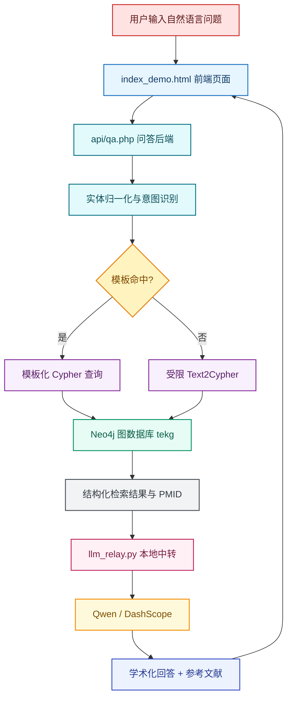

```mermaid
flowchart TD
    A[用户输入自然语言问题]:::user --> B[index_demo.html 前端页面]:::frontend
    B --> C[api/qa.php 问答后端]:::backend
    C --> D[实体归一化与意图识别]:::backend
    D --> E{模板命中?}:::decision
    E -- 是 --> F[模板化 Cypher 查询]:::query
    E -- 否 --> G[受限 Text2Cypher]:::query
    F --> H[Neo4j 图数据库 tekg]:::db
    G --> H
    H --> I[结构化检索结果与 PMID]:::context
    I --> J[llm_relay.py 本地中转]:::relay
    J --> K[Qwen / DashScope]:::llm
    K --> L[学术化回答 + 参考文献]:::answer
    L --> B

    classDef user fill:#ffe3e3,stroke:#c92a2a,color:#5f1a1a,stroke-width:1.5px;
    classDef frontend fill:#e7f5ff,stroke:#1971c2,color:#123b63,stroke-width:1.5px;
    classDef backend fill:#e3fafc,stroke:#0b7285,color:#0b4f59,stroke-width:1.5px;
    classDef decision fill:#fff3bf,stroke:#e67700,color:#7c4700,stroke-width:1.5px;
    classDef query fill:#f8f0fc,stroke:#862e9c,color:#5a1e68,stroke-width:1.5px;
    classDef db fill:#e6fcf5,stroke:#099268,color:#0b5d44,stroke-width:1.5px;
    classDef context fill:#f1f3f5,stroke:#495057,color:#343a40,stroke-width:1.5px;
    classDef relay fill:#fff0f6,stroke:#c2255c,color:#7a1e40,stroke-width:1.5px;
    classDef llm fill:#fff9db,stroke:#f08c00,color:#7a4e00,stroke-width:1.5px;
    classDef answer fill:#edf2ff,stroke:#364fc7,color:#243a8f,stroke-width:1.5px;
```

