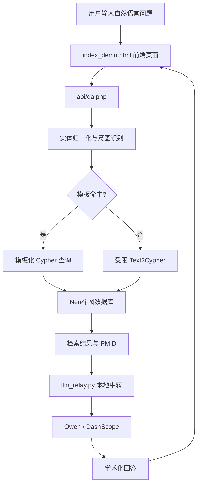

# 模块四 RAG 架构草稿

## 1. 推荐写法

本系统的智能问答模块采用基于本地知识库的检索增强生成架构。用户在前端页面输入自然语言问题后，系统首先在后端对问题进行实体归一化与意图识别；对于可控问题，优先走模板化查询；对于复杂问题，再进入受限 Text2Cypher 生成流程。随后系统在本地 Neo4j 图数据库中检索相关节点、关系及参考文献，将结构化结果整理为上下文，再调用 Qwen 大模型生成最终答案，并附带 PMID 或文献标题作为证据来源。

## 2. 可直接写进报告的流程分点

1. 用户在网页中输入自然语言问题。
2. PHP 后端接收问题并进行预处理。
3. 对问题进行实体归一化与意图识别。
4. 优先匹配受控问句模板。
5. 模板未命中时，调用受限 Text2Cypher 策略生成只读查询。
6. 在 Neo4j 中检索相关节点、关系路径与文献证据。
7. 将检索结果整理为结构化上下文。
8. 通过本地中转服务调用 Qwen 模型。
9. 模型生成学术化回答，并附参考文献。
10. 前端渲染 Markdown 格式答案并展示图谱内容。

## 3. 架构图文字版

```text
用户问题
   |
   v
前端页面 index_demo.html
   |
   v
PHP 接口 api/qa.php
   |
   +--> 实体归一化 / 意图识别
   |
   +--> 模板查询 或 受限 Text2Cypher
   |
   v
Neo4j 图数据库 tekg
   |
   v
结构化检索结果 + PMID
   |
   v
本地中转服务 llm_relay.py
   |
   v
Qwen (DashScope)
   |
   v
学术化答案 + 参考文献
   |
   v
前端展示
```

## 4. Mermaid 版本



## 5. Prompt 设计思路可写内容

- 限制模型只基于本地知识库结果回答。
- 要求回答采用学术化、客观化表达。
- 要求优先输出结论，再输出关键机制，最后输出参考文献。
- 若检索结果不足，明确说明“本地知识库暂无充分证据”。
- 不允许模型编造 PMID 或未检索到的关系。

