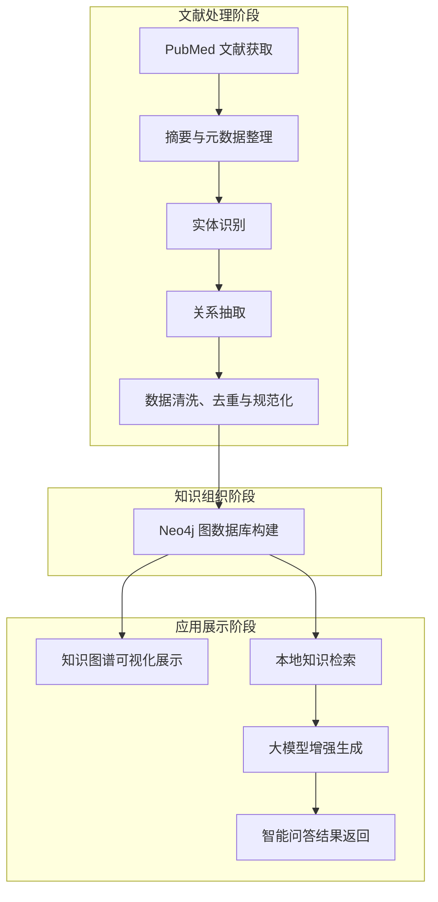
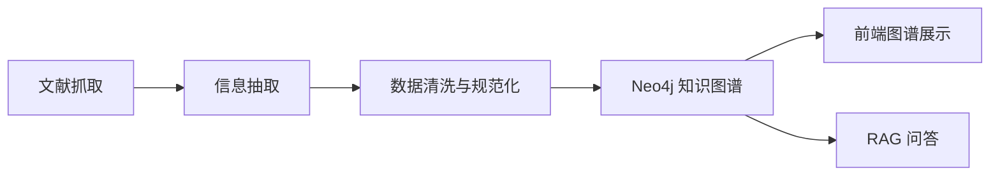

# 总体思路 Mermaid

```mermaid
flowchart TD
    A[PubMed 文献获取] --> B[摘要与元数据整理]
    B --> C[实体识别]
    C --> D[关系抽取]
    D --> E[数据清洗、去重与规范化]
    E --> F[Neo4j 图数据库构建]
    F --> G[知识图谱可视化展示]
    F --> H[本地知识检索]
    H --> I[大模型增强生成]
    I --> J[智能问答结果返回]

    subgraph 文献处理阶段
        A
        B
        C
        D
        E
    end

    subgraph 知识组织阶段
        F
    end

    subgraph 应用展示阶段
        G
        H
        I
        J
    end
```

## 简化版

```mermaid
flowchart LR
    A[文献抓取] --> B[信息抽取]
    B --> C[数据清洗与规范化]
    C --> D[Neo4j 知识图谱]
    D --> E[前端图谱展示]
    D --> F[RAG 问答]
```

## 适合答辩时的讲法

- 首先从 PubMed 获取与 LINE-1 相关的文献摘要和元数据。
- 然后对摘要进行实体识别和关系抽取。
- 接着对抽取结果做清洗、去重和规范化。
- 之后将结构化结果导入 Neo4j 图数据库，形成知识图谱。
- 最后在前端完成图谱展示，并结合本地图数据库和大模型实现智能问答。
