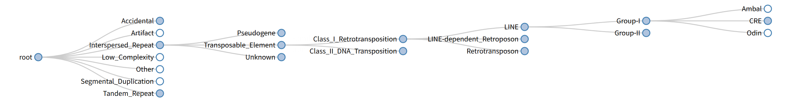
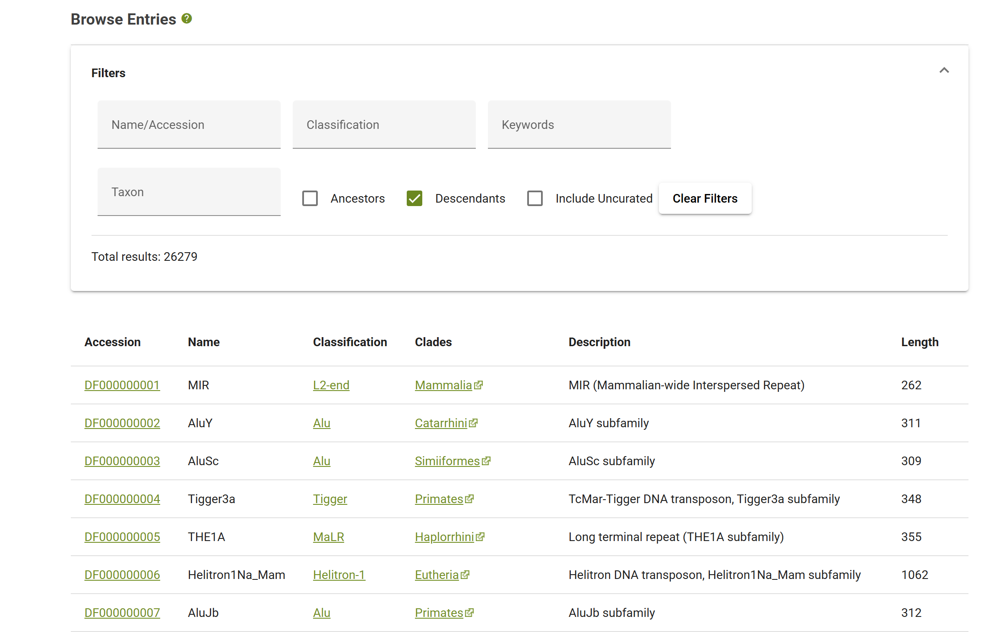

1. TE树（G6）√
   + 首页可以固定TE树，将人类转座子节点放在偏左边的位置
   + 其展开节点是横向展开，一个一个点开都是往右延伸，类似于Cyt的模式，主要模仿的是https://www.dfam.org/classification/tree 的形式
   + 
   + 采用新的分类规则，具体再议
1. search页面
   + 删除Best Match√
   + 底部可以出现测序信息，占满一行
   + 接着展示出序列结构图，并且可以显示每一部分的名称。并且使用SVG动画，当鼠标放在上面时，该部分及其名称可以微微上移。初版见“scripts\plot”的文件
   + 最后展示其在染色体的“密度”，即每Mb里出现了几次，具体参考现有插件
2. preview页面√
   + 可以全屏
3. 问答助手
   + 稳定实现问中文的时候就用中文回答√ 
   + 让AI能分析机制
   + 能够自由写Cypher
4. browse页面√
   + 新增加该页面，总体仿造https://www.dfam.org/browse
   + 即先显示过滤器
   + 然后下面是所有TE的表格

6. 扩充数据库
   + 将data/rmsk.txt作为新的详情页，替代repbase
   + 或者先这样吧，先暂时不讨论browse，先看看队友提供的新数据吧，位于data\rmsk.txt和data_update文件夹的所有文件。你大致浏览一下，看看目前待更新的数据有哪些？

7. 把overview右边的TE分类树图换成LINE1，且关键节点层数为2的动态图
---

## 补充说明

### 1. TE树（G6）
- 首页固定 TE 树，将人类转座子节点放在偏左边的位置
  思路：在首页把当前 G6 树图区做成固定模块，初始相机位置直接对准 human TE 主干，避免每次进入都重新找节点。这个改动主要是前端布局和初始视角控制。
  **实施难度：低到中。** 只要现有树数据稳定，主要是调布局、默认展开层级和初始 focus。
- 横向展开，点击后持续向右延伸，参考 Dfam classification tree
  思路：从现在“树能显示”升级到“横向层级树 + 右向展开”。参考图 `imgs/TE_tree.png`，技术上更像固定方向的 dendrogram，而不是自由力导向图。优先考虑直接在 G6 树布局里切到 LR 方向，再配合点击展开/收起。
  **实施难度：中。** 关键不是画出来，而是保证节点标签、折叠状态和大树性能都稳定。
- 采用新的分类规则
  思路：这里不要先硬改现有分类树，建议先单独整理一份新的分类映射表，再决定是否替换现有 lineage 数据。我已经看过 `C:\Users\Dee\Downloads\TEClasses.tsv`，它适合拿来做新的分类来源或对照表。
  **实施难度：中到高。** 前端树形展示不难，难点在于分类规则一旦改动，会连带影响搜索、browse、详情页和术语统一。

### 2. search页面
- 删除 Best Match
  思路：搜索页左上角现在的 `Best Match` 信息密度偏低，老师的意思更像是把空间让给真正有用的内容。实现上可以直接删卡片，或者保留容器但替换成更高价值的 summary。
  **实施难度：低。** 主要是页面布局和信息重排。
- 底部出现测序信息，占满一行
  思路：在 search 页底部新增一个全宽 panel，显示当前命中 TE 的 sequence 内容。数据来源先走 `TE_Repbase.txt`，例如 L1HS 在 `SQ   Sequence 6064 BP...` 下方已有完整序列。
  **实施难度：中。** 前端布局简单，难点在于后端要稳定解析 Repbase 文本并返回 sequence。
- 展示序列结构图，并显示每一部分名称，使用 SVG 动画
  思路：这块已经有一个很明确的初版，不是从零开始。我看过 `scripts/plot/L1HS_SVG.py`、`scripts/plot/base_SVG.py`、`scripts/plot/L1HS.html`，当前初版已经把 L1HS 画成分段结构，并有基础 hover 动效。下一步不是推翻，而是把它嵌到 search 页里，并把“矩形上移”扩展成“矩形 + 标签一起轻微上移”。
  **实施难度：中。** SVG 动画本身不难，真正要做的是把静态 demo 变成页面内的可复用组件。
- 展示其在染色体的“密度”
  思路：这一块更像“详情页统计图”。建议不要一上来就做全基因组复杂浏览器，而是先给当前 TE 做每条染色体上的 occurrences / Mb 汇总，再画成简单条形图或 ideogram 样式图。老师要的是“密度感知”，不是一步到位的 genome browser。
  **实施难度：中到高。** 前提是要先确认仓库里现有插件到底能复用到什么程度，以及后端有没有现成的坐标数据。

### 3. preview页面
- 可以全屏
  思路：这属于交互增强，不涉及数据库。优先做一个“进入全屏 / 退出全屏”按钮，作用在 preview 主容器上，而不是整页乱放大。
  **实施难度：低。** 主要是前端容器样式和全屏 API 适配。

### 4. 问答助手
- 问中文时稳定用中文回答 √
  思路：这个需求已经非常明确，核心不是功能扩展，而是语言判定要更稳定。优先保证“中文输入 -> 中文输出”这个最小闭环，再去谈更复杂的 QA 能力。
  **实施难度：中。** 难点不在逻辑本身，而在避免编码、提示词和前端传参互相打架。
- 让 AI 能分析机制
  思路：老师这里要的是“不是只会检索，还能解释为什么”。建议先限定在 TE -> function -> disease 或 TE -> mechanism -> disease 这类可追踪链路上做机制分析，而不是让模型自由发挥。
  **实施难度：高。** 因为这会同时依赖图谱结构、查询模板、答案组织和证据约束。

- 能够自由写Cypher
  思路：这项能力不建议一步做到“完全自由”，更稳的路线是三层结构。第一层仍然优先走现在的意图识别 + 固定模板查询；第二层在模板无法覆盖时，再进入受控的 NL2Cypher，让模型在给定 schema、示例和少量提示词工程的约束下生成只读 Cypher；第三层无论查询来自模板还是自由生成，都统一整理成固定的 rows / references / graph_context 结构，再交给回答模块生成答案。
  路线图：
  1. 先补提示词工程和少量示例，让模型学习当前图库 schema、常见节点标签、关系类型与查询风格。
  2. 再做“受控生成”而不是完全放开：只允许只读 Cypher，必须带 LIMIT，限制路径长度、聚合复杂度和可用标签/关系白名单。
  3. 把这些限制做成后台可配置参数，并且和“自定义回答深度”并列，允许后续按模式调整查询深度、返回行数、reference 数量和查询约束强度。
  4. 在后台统一规定查询结果的输出结构，不管 Cypher 是模板写的还是模型生成的，最后都转成统一字段，避免后续回答层和图谱联动层失稳。
  5. 继续保留当前模板问答主流程作为默认路径，把自由写 Cypher 放在兜底或扩展层，避免一上来就替换掉现在更稳定的模板查询。
  6. 对于“机制分析”这类本来就不适合单条自由 Cypher 直接解决的问题，仍然优先走原有模板链路或多步推理链路，而不是强行交给自由 Cypher。
  **实施难度：中到高。** 真正的难点不在生成一条 Cypher，而在 schema 对齐、只读安全限制、查询复杂度控制、结果结构统一和失败兜底。

### 5. browse页面
- 新增加该页面，总体仿造 https://www.dfam.org/browse
  思路：参考图 `imgs/browse.png` 已经很清楚了，结构就是上面过滤器、下面表格。这个页面本质是“TE 总览入口”，和 search/preview 不同，它要解决的是大规模浏览。
  **实施难度：中。** 页面形态清晰，但筛选条件和数据接口要先定好。
- 先显示过滤器
  思路：第一版不需要把 Dfam 全部功能照搬，可以先做 3 到 5 个最关键过滤器，例如 Name/Accession、Classification、Keywords、Taxon。
  **实施难度：中。** 前端控件不难，难点在于接口要支持组合筛选。
- 下面显示所有 TE 的表格
  思路：表格建议至少有 Name、Classification、Description、Length、Species 或 Clade。参考 `browse.png` 的风格，首版重点是可筛选、可分页，不必先追求特别复杂的表格交互。
  **实施难度：中。** 重点是查询性能和字段设计。

### 6. 扩充数据库
- 将 `data/rmsk.txt` 作为新的详情页，替代 Repbase
  思路：这是比较大的方向调整，意味着详情页的主数据源从 Repbase 转向 RepeatMasker/rmsk 体系。好处是数据覆盖和后续扩展潜力更大，但代价是现有 Repbase Reference 区块、字段命名和解析逻辑都要重新定义。
  **实施难度：高。** 它不是单点替换，而是详情页数据模型的重构。
